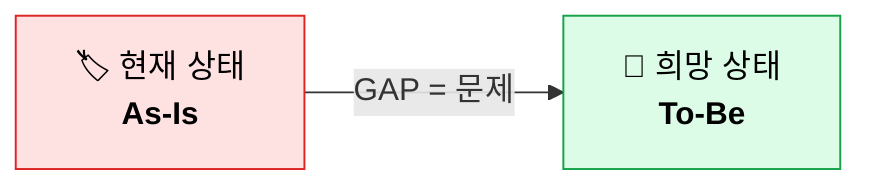
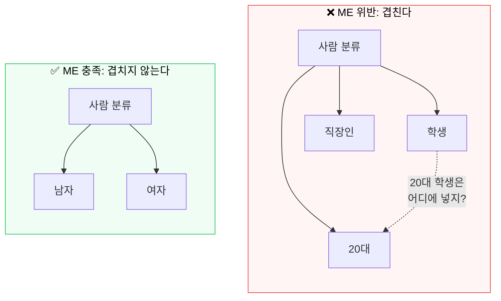
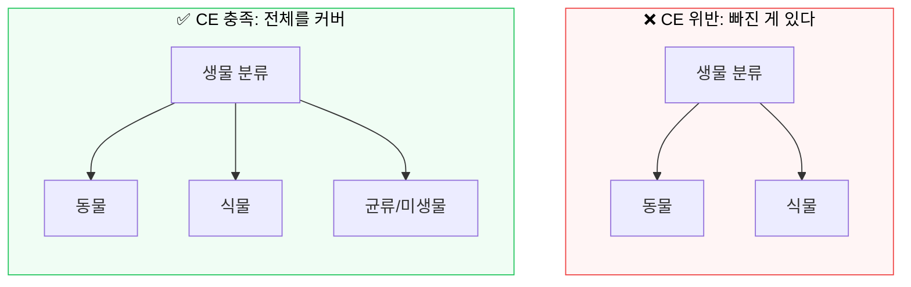
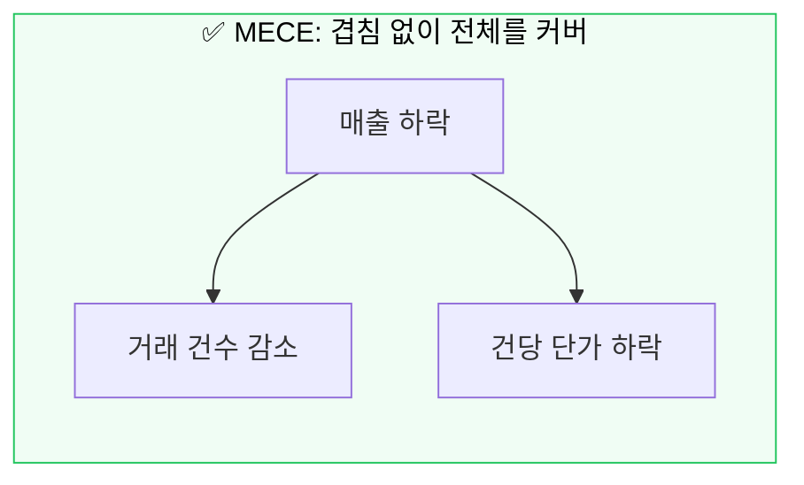
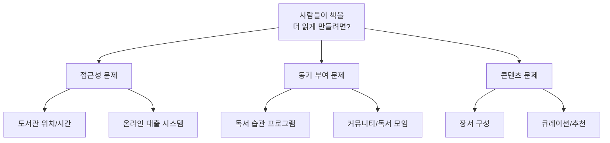
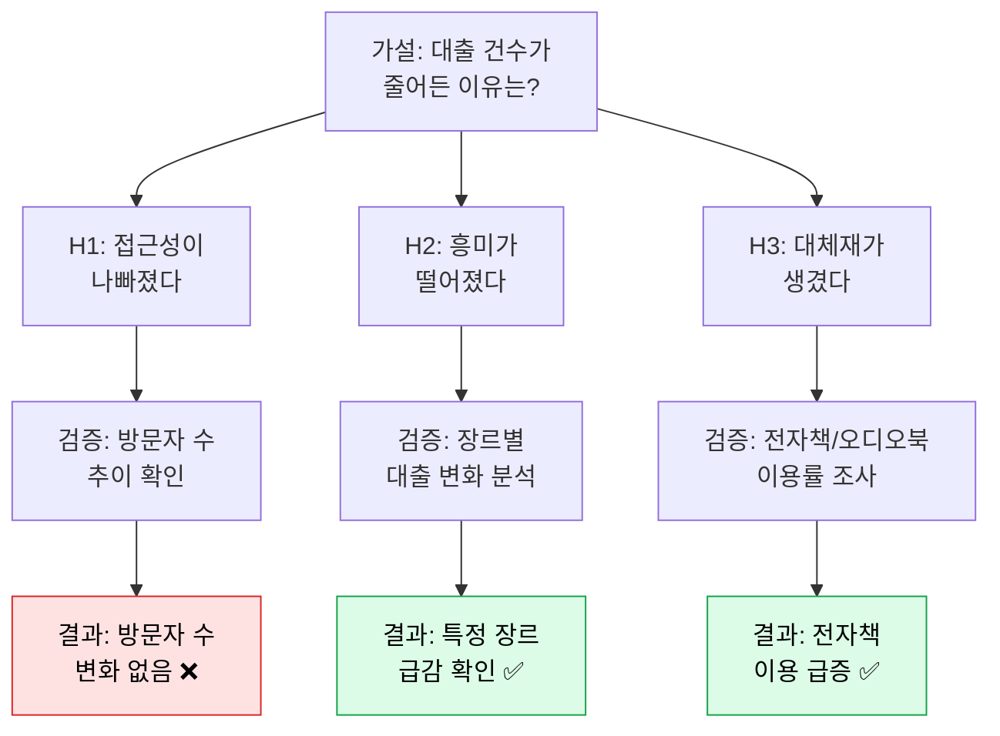
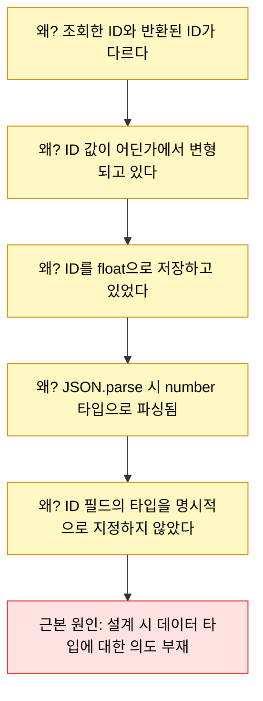
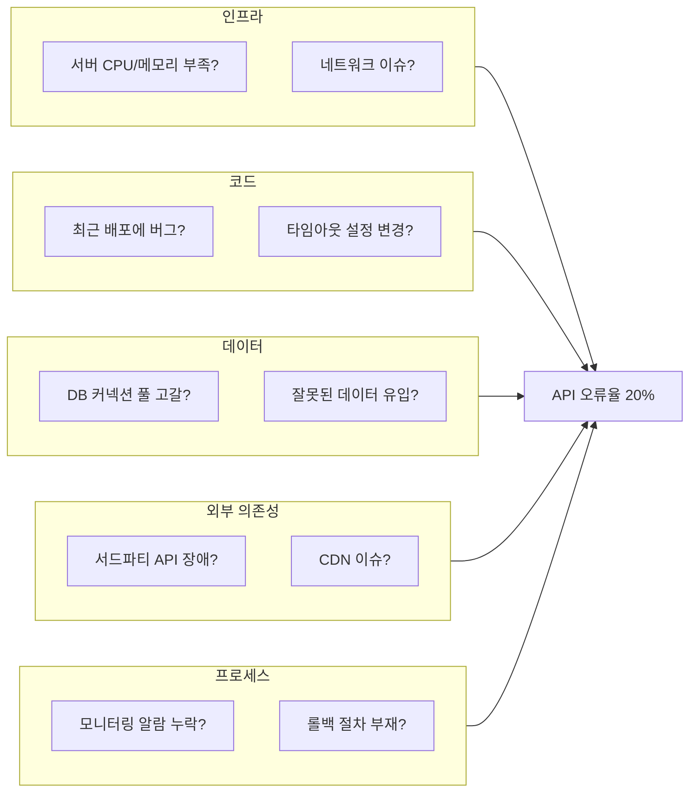
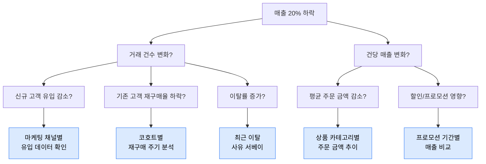
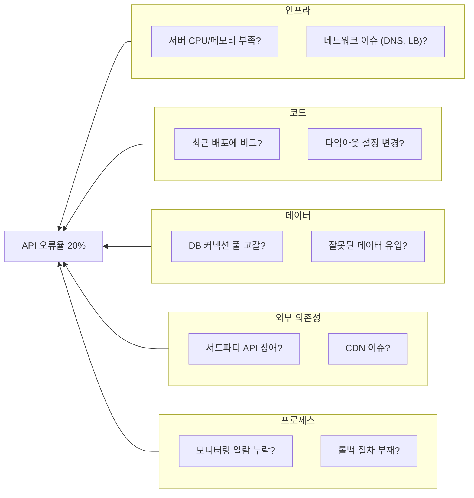

# 들어가기

:::note
엔지니어링의 정의, AI의 본질과 한계, 그리고 엔지니어가 문제를 푸는 방법.
:::

## 엔지니어링이란?

Claude에게 "엔지니어링이 뭐냐"고 물어보았다.

> Engineering is the application of scientific, mathematical, and practical knowledge to design, build, and maintain structures, machines, systems, and processes that solve problems or meet human needs.
>
> What unites all branches is a shared methodology: **identifying a problem, understanding the constraints** (cost, safety, materials, time), **designing a solution, testing it, and iterating** until it works reliably. Engineers balance creativity with rigor — they innovate, but within the bounds of physics, budgets, and safety standards.

꽤 잘 정리된 답이다. 키워드를 뽑아보면 다섯 가지로 압축된다:

1. **문제 식별**: 무엇이 문제인지 안다
2. **제약 이해**: 비용, 안전, 시간, 자원의 한계를 안다
3. **설계**: 제약 안에서 해법을 구상한다
4. **테스트**: 해법이 동작하는지 검증한다
5. **반복**: 안 되면 고치고, 다시 돌린다

정의를 읽어보면 고개를 끄덕이게 된다.

### 프로그램과 소프트웨어 엔지니어링

위 정의를 소프트웨어 엔지니어링에 대보면 아래와 같을 것이다.

1. **문제 식별**:

   - 프로그램을 통해 해결할 수 있는 문제를 안다.

2. **제약 이해**:

   - 비용: 구현 비용 / 처리 비용
   - 안전: 서비스 안정성 / 보안
   - 시간: 구현 / 요청당 처리 시간
   - 자원: 기술 스택 / 컴퓨팅 자원

3. **설계**: 트레이드 오프를 고려하여 적절한 아키텍쳐를 설계하고 구현한다.
4. **테스트**: 해법이 동작하는지 검증한다
5. **반복**: 안 되면 고치고, 다시 돌린다

소프트웨어 엔지니어링의 문제들은 대게 시간이 흐르면서 발생한다.

그래서 _[Software Engineering at Google](https://product.kyobobook.co.kr/detail/S000061352347)_(SWE Book)에서는 소프트웨어 엔지니어링을 이렇게 정의한다:

> **"Software engineering is programming integrated over time."**
>
> 소프트웨어 엔지니어링은 시간으로 적분된 프로그래밍이다.

프로그래밍과 엔지니어링의 차이를 표로 정리하면 이렇다:

|           | 프로그래밍               | 소프트웨어 엔지니어링             |
| --------- | ------------------------ | --------------------------------- |
| 목표      | **지금** 돌아가게 만든다 | **시간이 지나도** 돌아가게 만든다 |
| 시간 축   | 순간 (t=0)               | 적분 (∫dt)                        |
| 성공 기준 | "돌아간다"               | "계속 돌아간다"                   |

"지금 돌아가게 만드는 것"은 프로그래밍이다. 코드를 쓸 줄 아는 사람이라면, (이제는 AI라면), 누구나 할 수 있다. 문제는 **시간**이다. 시간이 지나면서 소프트웨어에 세 가지 압력이 누적된다:

1. **누적되는 유지보수** -- 코드는 쓰는 순간부터 낡기 시작한다. 의존성이 업데이트되고, OS가 바뀌고, 보안 취약점이 발견된다. 6개월 후에 돌아가지 않으면, 그건 엔지니어링이 아니라 일회용 스크립트다.
2. **트래픽 증가** -- 사용자 100명일 때 돌아가던 코드가 10만 명이 되어도 돌아가는가? 데이터가 1GB일 때 괜찮던 쿼리가 1TB일 때도 괜찮은가? 시간이 지나면 사용량이 늘고, 설계의 한계가 드러난다.
3. **누적되는 컨텍스트** -- 가장 과소평가되는 문제다. 코드가 늘어나면 "왜 이렇게 짰는지"를 아는 사람이 줄어든다. 원래 작성자가 퇴사하고, 요구사항의 배경이 구전으로만 남고, 어느 날 보면 아무도 이 코드가 왜 이런 모양인지 모른다. 코드는 있지만 의도가 사라진 것이다.

자연스럽게 놔둔다면 시간이 증가함에 따라 유지비용은 선형적으로, 때론 지수적으로 증가한다.

이 비용을 효과적으로 다루는 방법이 소프트웨어 엔지니어링이다. 코드를 짜는 행위가 아니라, **시간이 지나도 코드가 가치를 유지하도록 만드는 행위**가 엔지니어링이다.

### 코더와 엔지니어

코더(테크니션)와 엔지니어의 차이를 정리하면 이렇다:

|             | 코더 (테크니션)      | 엔지니어                             |
| ----------- | -------------------- | ------------------------------------ |
| 핵심 능력   | 명세대로 구현한다    | 문제를 정의하고 제약 안에서 설계한다 |
| 시간 감각   | "지금 돌아가면 된다" | "6개월 후에도 돌아가야 한다"         |
| AI와의 관계 | AI가 대체할 수 있다  | AI를 도구로 쓴다                     |
| 의사결정    | "어떻게(How)"        | "왜(Why)" + "무엇을(What)"           |

"이거 구현해줘"라고 하면 구현하고, "저거 고쳐줘"라고 하면 고치는 역할은 줄어들 것이다. AI가 그 일을 점점 더 잘하고 있기 때문이다.

[코더의 역할을 대체](https://namu.wiki/w/WYSIWYG)하려는 역사는 유구하다.

한 시대를 풍미했던 플래시 게임을 기억하는가? 플래시 게임이 융성할수 있었던 배경에는 [개발자가 아님에도 쉽게 프로그램을 구성](https://www.youtube.com/watch?v=usGgol1JJwU)할 수 있었기 때문이었다.

같은 시대가 낳은 풍운아, [나모 웹 에디터](https://namu.wiki/w/%EB%82%98%EB%AA%A8%20%EC%9B%B9%EC%97%90%EB%94%94%ED%84%B0) 같은 것도 있다.

같은 관점에서 AI 는 코더를 대체한다. 다만 이전과 다르게 전가의 보도 같은 도구다.

정녕 AI 가 엔지니어의 역할을 대체할수는 없을까? AI 에 대해서 알아보고 스스로 판단해보자.

## 엔지니어링과 AI

### 모델이란

"AI"라는 단어가 너무 많이 쓰이다 보니 실체가 흐려진다. 근본으로 돌아가자.

모델(Model)이란 **실제 현상과 결과를 피팅하는 작업**이다. 현실 세계에서 관찰된 데이터를 가져다가, "이 입력이 들어오면 이 출력이 나온다"는 관계를 수학적으로 근사하는 것이다.

:::note

모든 모델은 결국 `f(x) = y` 이다.

오늘의 강수확률 모델은

`f([90일간의 구름 레이더 지도, 기온, ...]) = 강수 확률`

llm 이라면 아래와 같은 모델일것이다.

f("python 으로 hello world 짜줘") = "print('hello world')"
:::

딥러닝 모델의 본질은 결국 **matrix multiplication의 집합**이다. 행렬을 곱하고, 비선형 함수를 통과시키고, 또 행렬을 곱하고 -- 이 과정을 수십, 수백 레이어 반복한다. 그 행렬들의 값(파라미터)을 데이터에 맞춰 조정하는 게 학습(training)이다.

핵심은 단순하다: **비선형적인 탐색 공간에서 입력과 출력의 관계를 피팅하기 위한 행렬 곱셈의 집합.** 그 이상도, 그 이하도 아니다.

### 분포 가설

그러면 언어 모델(Language Model)은 무엇을 피팅하는가?

언어학에 **분포 가설(Distributional Hypothesis)**이라는 개념이 있다:

> **"비슷한 맥락에서 등장하는 단어는 비슷한 의미를 가진다."**

"고양이는 **_에서 잔다"와 "강아지는 _**에서 잔다" -- 빈칸에 들어갈 단어들이 비슷하다면, "고양이"와 "강아지"는 의미적으로 가깝다는 뜻이다. 언어 모델은 이 분포를 학습한다. 거대한 텍스트 데이터에서 "이 맥락 다음에 어떤 단어가 올 확률이 높은가"를 피팅한 것이다.

트랜스포머(Transformer)와 어텐션(Attention) 메커니즘은 이 피팅을 매우 효과적으로 해내는 구조다. 문맥의 어떤 부분에 주목할지를 학습하면서, 긴 텍스트에서도 맥락을 잃지 않는다.

결과적으로 언어 모델은 **인류가 쓴 텍스트의 통계적 분포를 압축한 것**이다. 정의를 잘 말해주고, 코드를 잘 짜주고, 번역을 잘 해주는 건 -- 그 모든 게 텍스트 데이터에 들어있었기 때문이다.

### 말하는 백과사전

AI의 본질에 대한 직관 하나를 공유한다.

> **현재의 AI는 "말하는 백과사전"에 가깝다.**

엄청나게 많은 것을 알고 있고, 물어보면 유창하게 대답한다. 어떤 질문이든 합리적으로 들리는 답을 내놓는다. 하지만 백과사전이 문제를 해결하지는 않는다. 백과사전은 참고하는 것이다.

"사람이 문제를 해결하는 것도 결국 뇌에 저장된 지식과 경험을 조합하는 거 아닌가? 그러면 충분히 큰 모델은 사람처럼 문제를 풀 수 있는 거 아닌가?" -- 이 반론은 충분히 타당하다.
다만 현대 과학은 아직 "이성이란 무엇인가", "생각이란 무엇인가"에 대해 답을 내지 못했다. AI가 정말로 "이해"하는 건지, 이해하는 것처럼 보이는 건지, 트랜스포머가 언젠가 생각하는 존재가 될까? -- 확정적으로 대답할 수 있는 사람은 없다.

다만, 현재 AI가 못하는 게 있다는 근거는 있다.

### ARC-AGI-3

2026년 3월에 발표된 ARC-AGI-3 벤치마크는 이전 버전(ARC-AGI-1, ARC-AGI-2)과 완전히 다르다. 이전 버전은 정적인 시각 퍼즐이었고, 프론티어 모델들이 거의 풀어버렸다(Gemini 3.1 Pro가 ARC-AGI-1에서 98%). 그래서 더 어려운 버전이 나왔다.

ARC-AGI-3의 방식:

- 64x64 컬러 그리드 환경에 에이전트를 떨어뜨린다
- **규칙이 없다** -- 환경의 법칙을 스스로 탐색해야 한다
- **목표가 없다** -- "이기는 조건"을 스스로 발견해야 한다
- **언어 힌트가 없다** -- 자연어 설명이 일절 없다

결과:

|            | 점수     |
| ---------- | -------- |
| **Human**  | **100%** |
| Gemini 3.1 | 0.37%    |
| GPT-5.4    | 0.26%    |
| Opus 4.6   | 0.25%    |
| Grok-4.20  | 0%       |

사람은 100% 푼다. 최고 성능의 AI는 0.37%. 엔지니어들이 30일 동안 매달려서 만든 에이전트 시스템조차 12.58%에 불과했다.

현재 AI는 **이미 알려진 패턴을 재조합하는 데는 뛰어나지만, 완전히 새로운 환경에서 탐색하고 목표를 스스로 설정하는 능력은 사실상 없다.** 정의를 말해주는 것과 정의대로 행동하는 것은 다르다 -- 처음에 던진 그 질문이 여기서 다시 돌아온다.

기존에 있는 지식을 엮어 보는 능력은 정말 탁월하다. 완전히 novelty 가 존재하는 문제에도 유효한지는 아직 모른다.

## AI의 한계 -- 비용과 의도

### 비용

가정을 하나 해보자: AI가 기술적으로 모든 태스크를 100% 풀 수 있다고 치자. 그래도 문제가 있다. 돈이다.

[26년 2월에 작성된 글](https://machine-learning-made-simple.medium.com/how-much-does-one-ai-token-really-cost-3e98f2a877f6)을 토대로 최근 모델들의 1M(백만) 토큰당 운영 비용을 추정해보았다:

| 모델                   | 추정 운영 비용 (1M 토큰) | 비고                              |
| ---------------------- | ------------------------ | --------------------------------- |
| Haiku (경량)           | ~$1.25                   | 간단한 태스크용 (블로그에서 재시) |
| Opus (대형)            | $50 ~ $125               | Haiku 대비 100~200배 규모         |
| Mythos (차세대 초대형) | $125 ~ $180              | 추정치, 변수 많음                 |

변수가 많다 -- 캐시 히트율, 배치 효율, 하드웨어 발전 등. 기술이 발전하면 10배 정도는 쉽게 개선될 수 있을 것이라 생각한다.

그러나 100배 정도 개선할수 있을까? 알 수 없다. 하지만 현재 시점에서 "AI로 모든 걸 대체하겠다"는 건 경제적으로 말이 안 된다.

AI 에도 무어의 법칙이 적용될까?

지금 AI 회사들은 시장을 선점하기 위해 원가 이하로 API를 제공하고 있다. 영원히 이 가격이 유지될 거라고 생각하면 안 된다. 언젠가는 진짜 비용을 치러야 한다.

### 의도

비용보다 더 근본적인 한계가 있다. 소프트웨어 엔지니어가 하는 일의 핵심은 **"의도를 결정하는 것"**이다.

엔지니어만이 다루는 문제 5가지:

1. **추상화** -- 현실의 복잡성을 어디까지 단순화할 것인가
2. **모델링** -- 현실을 소프트웨어로 어떻게 표현할 것인가
3. **의도 표현** -- 코드가 "왜" 이런 모양인지를 명확히 하는 것
4. **트레이드오프 관리** -- 속도 vs 품질, 단기 vs 장기, 비용 vs 성능
5. **변화 대응** -- 요구사항이 바뀌었을 때 기존 설계를 어떻게 진화시킬 것인가

이 다섯 가지에는 **정답이 없다.** 상황마다 다르고, 가치관에 따라 다르고, 조직의 맥락에 따라 다르다.

비유를 들어보자. 목돈이 생겼다. 집을 살까? 채권에 투자할까? 예금해둘까? 이 질문에 "정답"은 없다. 개인의 상황, 리스크 허용도, 미래 전망에 따라 달라진다. AI에게 물어보면 각 선택지의 장단점을 잘 정리해준다. 하지만 **결정은 AI가 하지 않는다.** 결정에 대한 책임을 질 수도 없다.

소프트웨어 엔지니어링도 마찬가지다. "이 시스템을 모놀리스로 갈까, 마이크로서비스로 갈까?" "이 기술 부채를 지금 갚을까, 다음 분기에 갚을까?" -- 이 결정들은 맥락에 의존하고, 결과에 책임이 따르고, 정답이 없다. 말하는 백과사전은 이런 문제를 대신 풀어주지 않는다.

AI 가 대부분의 결정을 다 해줄수 있다고 치자.

그래도 최초 프롬프트는 누군가 넣어줘야한다.

누군가는 "네이버처럼 만들어주세요" 를 말이되는 요구사항의 뭉치로 바꿔주긴 해야한다.

## 어엿한 엔지니어?

엔지니어링의 첫 단계는 **문제를 정의하는 것**이다. 놀랍게도 많은 주니어 개발자들이 이 단계를 건너뛴다. "뭔가 안 된다 -> 바로 코드를 고친다"로 직행하는 것이다. 그런데 문제를 정확히 정의하지 않으면, 풀고 있는 게 진짜 문제인지조차 모른다.

### Gap 분석

문제 정의의 가장 기본적인 프레임워크는 **Gap 분석**이다:



예시:

|           | 내용                                          |
| --------- | --------------------------------------------- |
| 현재 상태 | 도서관 운영자인데, 사람들이 책을 잘 안 읽는다 |
| 희망 상태 | 사람들이 책을 더 많이 읽었으면 좋겠다         |
| **GAP**   | **사람들이 책을 더 많이 읽게 만들어야 한다**  |

단순해 보이지만 이게 출발점이다. "사람들이 책을 안 읽어요"는 불만이지, 문제 정의가 아니다. 현재와 희망 사이의 Gap을 명시적으로 적는 순간, 비로소 "무엇을 해결해야 하는지"가 보인다.

Gap이 정의되면 다음 질문은: **왜 이 Gap이 존재하는가? 어떻게 좁힐 수 있는가?**

### MECE 원칙

Logic Tree를 다루기 전에, 그 핵심 원칙인 **MECE**부터 짚고 가자.

**MECE(Mutually Exclusive, Collectively Exhaustive)** -- 문제를 분해할 때 **겹침 없이, 빠짐 없이** 나누는 원칙이다.

#### ME -- Mutually Exclusive (상호 배타)

각 가지가 서로 겹치지 않아야 한다.



왼쪽은 "학생"과 "20대"가 겹친다. 20대 학생은 두 가지에 동시에 속한다. 이렇게 나누면 분석할 때 같은 대상을 두 번 세게 된다. 오른쪽은 남자/여자 -- 한 사람이 두 가지에 동시에 속할 수 없다.

#### CE -- Collectively Exhaustive (전체 포괄)

모든 가지를 합치면 전체를 빠짐없이 커버해야 한다.



"동물과 식물"로 나누면 직관적으로 전부인 것 같지만, 버섯(균류)이나 세균은 어디에도 속하지 않는다. CE를 만족시키려면 빠지는 범주가 없는지 점검해야 한다.

#### MECE가 둘 다 되면

ME와 CE를 동시에 만족하는 분해 -- **겹침 없이, 빠짐 없이** -- 가 MECE다.



매출 = 거래 건수 × 건당 단가. 둘은 겹치지 않고(ME), 합치면 매출 전체다(CE). 이렇게 나누면 빠뜨리는 게 없고 중복 분석이 없다. 이것이 엔지니어링적 사고의 기본 근육이다.

:::tip MECE 분해 팁
수학적으로 MECE한 분해의 가장 쉬운 형태는 **하나의 양을 구성 요소로 나누는 것**이다:

- 매출 = 거래 건수 × 건당 단가
- 전환율 = 유입 × 클릭률 × 구매율
- 응답 시간 = 네트워크 시간 + 서버 처리 시간 + 렌더링 시간

곱셈이나 덧셈으로 분해하면 겹칠 수가 없고, 합치면 전체가 된다.
:::

### Logic Tree

Logic Tree는 문제를 체계적으로 분해하는 도구다. MECE 원칙을 적용해서 문제를 나무 구조로 펼치는 것이다.

실전에서 자주 쓰는 Logic Tree 4가지를 하나씩 살펴보자.

#### 1. Issue Tree

**문제를 하위 이슈로 분해한다.** "이 문제는 어떤 하위 문제들로 구성되어 있는가?"를 재귀적으로 묻는다. 전체 구조를 파악할 때 좋다.



Issue Tree의 핵심은 **구조화**다. 모호한 큰 문제를 MECE하게 쪼개서, 각 하위 문제를 독립적으로 다룰 수 있게 만든다. "책을 안 읽는다"는 막연한 고민이 "접근성, 동기, 콘텐츠" 세 축으로 정리되면, 어디부터 손댈지가 보인다.

#### 2. Hypothesis Tree

Issue Tree와 비슷하지만, 각 가지가 **검증 가능한 가설**이다. "이것이 원인일 것이다"라는 가설을 세우고, 데이터로 검증한다.



Hypothesis Tree의 장점은 **검증 기준이 명확하다**는 것이다. 각 가설에 "이 데이터를 보면 맞는지 틀리는지 알 수 있다"는 검증 방법이 붙어있다. 데이터를 보기 전에 가설을 세우면, 확증 편향(자기가 보고 싶은 것만 보는 것)을 줄일 수 있다.

#### 3. 5 Whys

도요타에서 만든 기법이다. **"왜?"를 5번 반복하면 근본 원인에 도달한다.** 표면 증상에서 근본 원인까지 수직으로 파고드는 도구다.



5 Whys는 다른 Logic Tree와 방향이 다르다. Issue Tree나 Hypothesis Tree가 **수평으로 펼치는** 도구라면, 5 Whys는 **수직으로 파고드는** 도구다. "왜?"를 반복할 때마다 한 층 더 깊이 들어간다. 표면 증상을 고치는 게 아니라 근본 원인을 찾아야 재발을 막을 수 있다.

:::caution 5 Whys의 함정
"왜?"를 기계적으로 5번 묻는 게 아니다. 핵심은 **"내가 지금 보고 있는 게 증상인가, 원인인가?"**를 계속 자문하는 것이다. 3번 만에 근본 원인에 도달할 수도 있고, 7번이 걸릴 수도 있다. 숫자 5에 집착하지 말자.
:::

#### 4. Fishbone (Ishikawa) Diagram

원인을 **카테고리별로 정리**한다. 제조업에서 유래했지만 소프트웨어에서도 유용하다. 여러 팀이 협업할 때 특히 좋다 -- "이건 인프라 문제인가, 코드 문제인가, 프로세스 문제인가"를 한눈에 정리해준다.



Fishbone의 장점은 **팀 간 의사소통 도구**로 쓸 수 있다는 것이다. 장애가 터졌을 때 "인프라팀은 인프라 가지를, 백엔드팀은 코드 가지를, DBA는 데이터 가지를 확인하세요"라고 역할 분배가 바로 된다. 패닉에 빠지지 않고 체계적으로 원인을 좁혀갈 수 있다.

### 가설 검증

Logic Tree로 문제를 분해하고, 가설을 세웠다. 이제 검증할 차례다.

:::tip Breakable Toys -- 부서도 괜찮은 장난감

*Apprenticeship Patterns*라는 책에 나오는 개념이다. 가설 검증은 완벽한 솔루션을 만드는 게 아니다. **부서져도 괜찮은 수준의 프로토타입**을 빠르게 만들어서, 내 가설이 맞는지를 확인하는 것이다.

- **가설이 틀리면?** 좋은 소식이다. 틀린 방향을 빨리 배제했으니까. 프로토타입을 버리는 데 아까울 게 없다 -- 애초에 부서져도 괜찮게 만들었으니까.
- **가설이 맞으면?** 그때 본격적으로 설계하면 된다. 프로토타입에서 얻은 통찰이 본 설계의 밑거름이 된다.

실무에서 이걸 못 하는 이유는 대부분 심리적이다. "이미 3일 걸렸는데 버리기 아깝다" -- 이게 매몰 비용의 오류(sunk cost fallacy)다. 3일짜리 프로토타입을 버리는 게, 잘못된 방향으로 3개월을 달리는 것보다 훨씬 싸다.
:::

핵심은 **가설 -> 실험 -> 검증의 사이클을 빠르게 도는 것**이다. 한 번에 완벽한 답을 내려고 하지 말고, 작은 실험으로 방향을 잡아가는 것. 이것이 엔지니어링의 반복(iteration)이다.

### 실전 예시

#### 예시 1: float ID 버그 -- 5 Whys

> **문제: "작품 ID 123456789012345678을 조회했는데, 123456789012345680이 나와요."**

5 Whys로 파고들어 보자:


TypeScript에서 큰 정수를 float(IEEE 754 double)으로 다루면 정밀도 손실이 발생한다. 아래에서 직접 실행해보자:

```jsx live showLineNumbers
function Test_Json에서_숫자_변환시_floating_point_precision으로인한_손실이_발생한다() {
  // given: 엄청나게 큰 수
  const id = "123456789012345678";
  // when: json 파싱시 IEEE 754 double 형태의 숫자로 보고 변환한다.
  const parsed = JSON.parse(id);

  return String(parsed) === id ? "✅ 일치" : "❌ 불일치 — 정밀도 손실";
}
```

"ID를 float으로 저장한 것"이 문제인가? 아니다. 그건 증상이다.

근본 원인은 **"ID 필드의 타입을 명시적으로 지정하지 않은 것"** -- 즉, 설계 시 데이터 타입에 대한 의도가 없었던 것이다.

소프트웨어에 대한 미감이 있었다면, 구린 느낌을 받아야한다.

1. id 가 너무 길다.
2. 근데 숫자로 파싱한다. 숫자 범위를 넘어가진 않을까?

일단 구린 냄새가 난다. "IEEE754, 혹은 Number System" 에 대해 생각해 볼 수 있다면, 정확히 그 이유도 알 수 있다.

이런 내용은 향후 **절차와 순서** 에 대해 다룰 때 같이 다룬다.

#### 예시 2: 매출 하락 -- Issue Tree

> **문제: "이번 달 매출이 20% 하락했습니다."**

Issue Tree로 분해하면:



"매출이 떨어졌어요"라는 모호한 문제가 **데이터로 검증 가능한 5개의 구체적인 질문**으로 바뀐다. 각 가지를 데이터로 확인하면, 어디가 진짜 문제인지가 드러난다.

#### 예시 3: API 오류율 -- Fishbone

> **문제: "API 오류율이 갑자기 20%가 되었습니다."**

Fishbone으로 원인을 카테고리별로 정리하면:



실제 장애 상황에서 이 다이어그램을 머릿속에 그리면, 패닉에 빠지지 않고 체계적으로 원인을 좁혀갈 수 있다. "인프라는 정상인가? -> 정상. 최근 배포가 있었나? -> 있었다. -> 배포 내용 확인" -- 이런 식으로.

# 마치기

엔지니어링은 "문제를 정의하고, 제약 안에서 설계하고, 검증하고, 반복하는 것"이다. AI는 이 과정에서 강력한 도구가 될 수 있다. 하지만 도구일 뿐이다.

AI와 함께 엔지니어링하는 방법론을 한 줄로 줄이면:

> **Define -> Divide -> Conquer**

1. **Define** -- 문제를 정의한다 (Gap 분석)
2. **Divide** -- 문제를 분해한다 (Logic Tree)
3. **Conquer** -- 분해된 하위 문제를 AI와 함께 하나씩 해결한다

1번과 사람이 해야 한다. 2번은 AI 의 도움을 받을 수 있겠지만 결국 사람이 해야한다. AI는 3번에서 힘을 발휘한다. 잘 정의되고 잘 분해된 문제에 대해서는 AI가 놀라울 정도로 잘 답한다. 하지만 문제를 잘못 정의하면? AI는 잘못된 문제를 아주 유창하게 풀어줄 뿐이다.

필자는 본 강의 노트를 구성하고자 마음 먹었다.

bun 과 typescript, docusaurus 와 reveal.js 를 사용하여 멀티모듈형 소스 레포를 구성하기로 결정하였고, AI 를 통해 구현 도움을 받았다.

이후, 마음에 안드는 부분은 직접 수정했다.

이후, 코드를 한번 보고 구린 부분은 다시 요청하거나, 질문하거나 직접 손보았다.

1장에 들어갈 내용들은 필자가 직접 선정했다.

얼개는 필자가 구성하였지만, AI 에게 리뷰를 요청했다.

절반 정도는 AI 가 쓰고, 나머지 절반은 필자가 작성했다.

.

:::note
엔지니어링 감각이 없으면 AI에게 좋은 질문을 할 수 없다.
엔지니어링 감각이 없으면 AI가 가지고 온 결과물을 판단할 수 없다.
:::

## 글감들

첫 강의에서는 **소프트웨어 엔지니어링 세부항목**에 대한 미감 포인트 보다는 **엔지니어링** 그 자체를 주제로 미감 포인트를 찾아보았다.

직관적인 결정에 비해 **근거있는 의사 결정**은 아름답다.

재현 가능하고, 누구나 연습을 통해 익힐 수 있다.

이어서 생각중인 주제들은 아래와 같다:

- **절차와 순서, 그리고 흐름**: 마법은 없다, 프로그램이 동작하려면 누군가는 무언가를 챙기고 있어야한다.
  - 프로토콜, 예외, 시스템 흐름, 협업 등
- **중복과 재사용**: 어디까지는 복붙하고, 어디부터는 가져다 쓸까?
  - 객체, 상속, 함수형, 구성, 인터페이스
- **의미 단위**: 어디서부터 어디까지를 "나" 라고 부를수 있는가? 코드에서 이름을 지어준다는 것은?

  - 코드 쪼개기, 상태, field presence, 일관성, 복잡도 등

- **도구**: 소프트웨어 엔지니어가 접하는 도구들의 작동 방식

  - 기게와 연결
  - 깃, 셸, 환경 변수
  - 도커, 쿠버네티스

- **트레이드오프**: 엄마가 좋아? 아빠가 좋아? 선택을 해야한다. 근데 거기에 후회는 없어야 한다.

  - 스루풋, 레이턴시, 속도, 크기, CAP 등.

- **강건함**: 고객이 또 뭔가 바꿔달라했다. 괜찮을까?

  - 테스트, 호환성과 무중단
