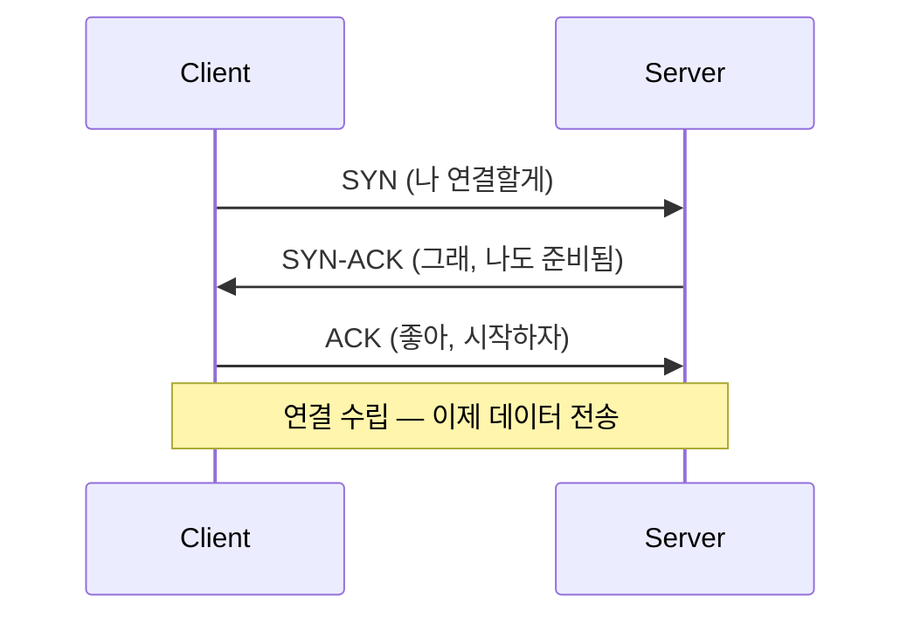
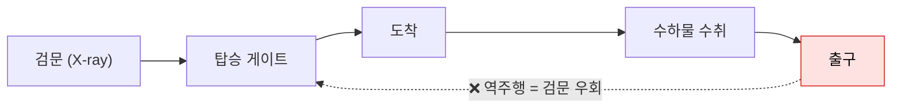
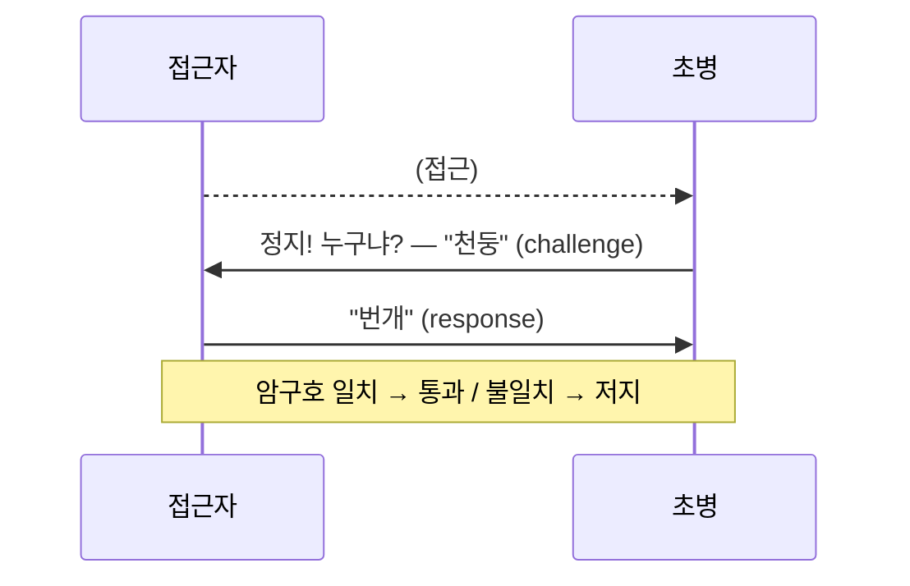
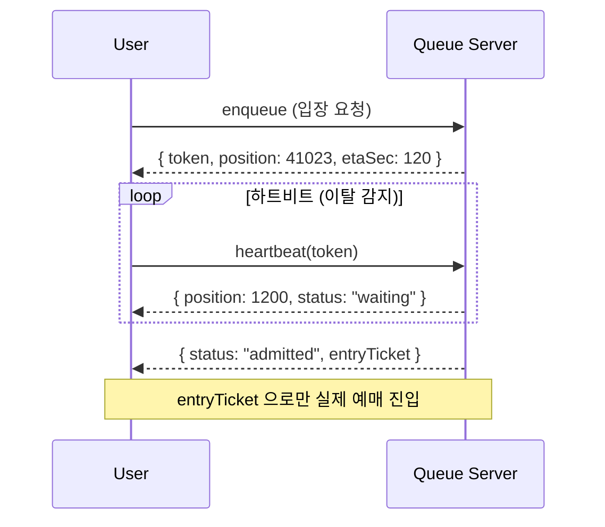
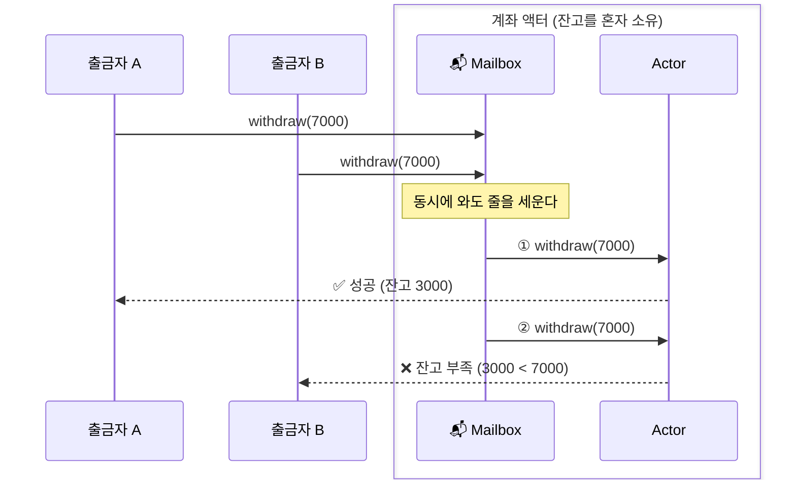
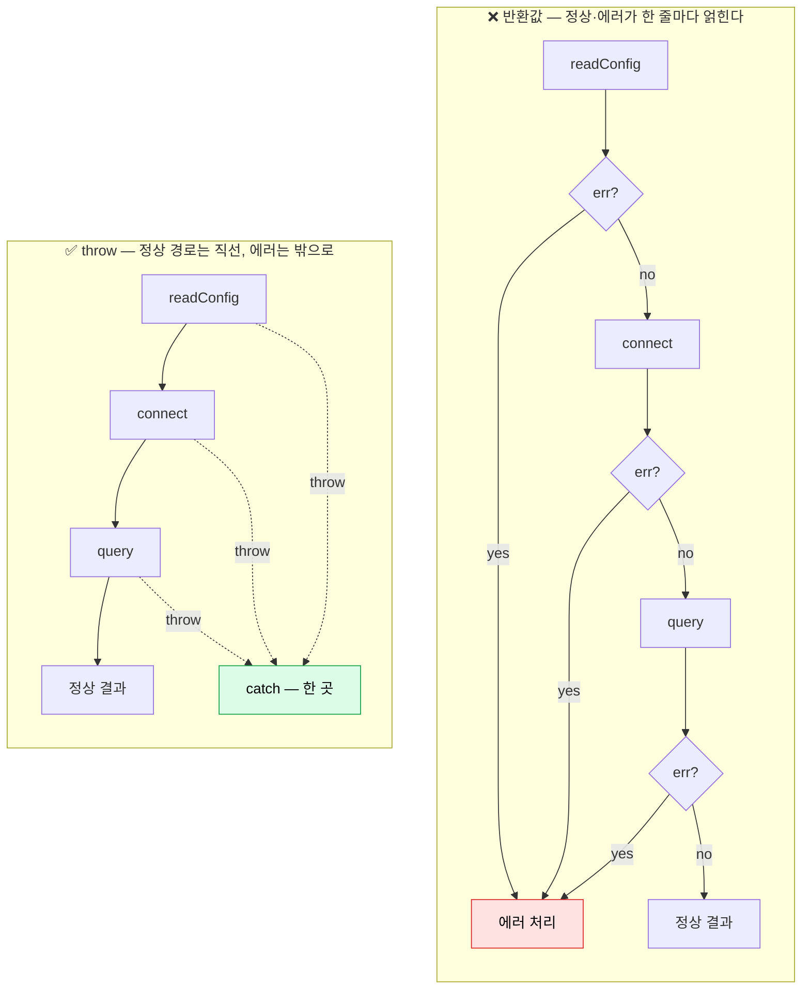
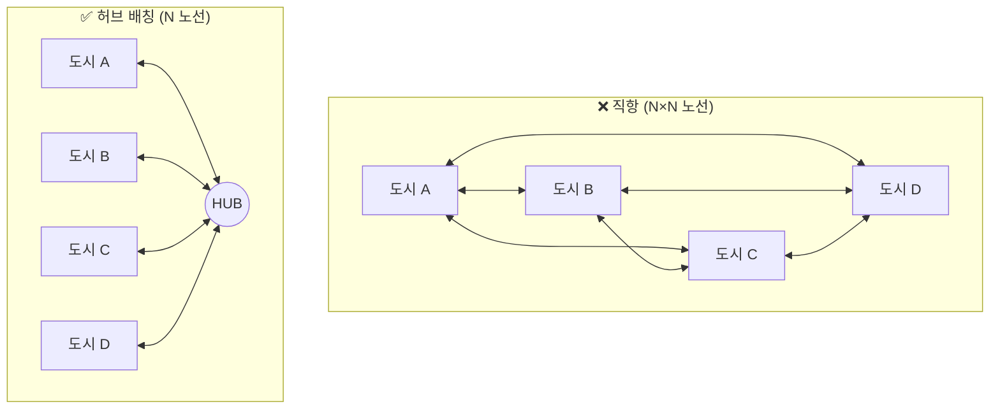
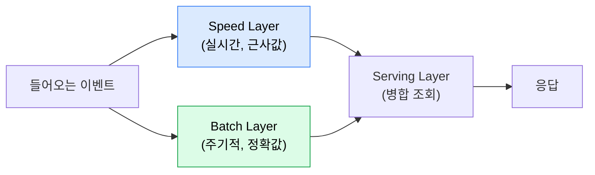

# Procedure and Order

:::note
프로그램은 결국 **절차**다. 좋은 절차는 단순하고, 빈틈이 없고, 효율적이다. 프로토콜 / 자원과 오너십 / 예외 / 배칭이라는 네 개의 렌즈로 "절차의 미감"을 들여다본다.
:::

## 1. 프로그래밍이라는 말

"프로그램(program)"이라는 단어는 코드만의 것이 아니다. 방송에서 프로그램은 **진행 순서**고, 공연에서 프로그램은 **차례**다. 무언가의 **진행 목록이나 순서**를 뜻하는 말이다.

컴퓨터에서의 프로그램도 다르지 않다. **명령어의 집합**, 즉 "무엇을 어떤 순서로 할 것인가"다.

그래서 이 장에서 다루는 내용은 현실 세계와 별로 다르지 않다. 우리가 매일 겪는 절차 — 은행 번호표를 뽑고, 병원에 입원하고, 택배를 부치는 일 — 의 설계 원리가 그대로 코드에 적용된다. **절차를 어떻게 설계하는가**가 주제다.

### 1.1 절차의 미감

이번 장의 미학 포인트는 두 가지다.

- **상식적인가?** — 처음 보는 사람도 "아, 그렇게 흘러가겠구나"를 예측할 수 있는가.
- **단순한가?** — 군더더기 없이, 꼭 필요한 단계만 있는가.

:::note Fedex 이야기 — 절차 하나로 세운 회사
Fedex는 "절차 설계"로 먹고사는 회사다. 그리고 그 시작부터가 절차에 건 회사였다.

창업자 **프레드 스미스(Fred Smith)** 가 학생 시절 과제로 스케치한 아이디어는 단순하지만 과감했다. 당시 항공 화물은 보내는 도시에서 받는 도시로 **곧장** 실어 날랐다. 스미스의 제안은 정반대였다 — 모든 화물을 일단 **중앙 허브 한 곳(멤피스)** 으로 모은다. 밤사이 거기서 전부 분류한 뒤, 다시 목적지로 내보낸다.

상식과 어긋나 보였다. 옆 도시로 갈 짐도 굳이 멀리 떨어진 허브까지 갔다가 되돌아온다. 경쟁자 누구도 이렇게 하지 않았다. 하지만 바로 이 절차가 **"전국 어디든 익일 배송 보장"** 을 처음으로 가능하게 만들었다. 도시마다 직항을 까는 대신, 절차를 하나 갈아끼운 것만으로.

핵심은 이거다. Fedex가 이긴 건 더 좋은 트럭이나 더 빠른 비행기 덕이 아니다 — 그건 경쟁자도 다 가지고 있었다. 이긴 건 **더 나은 절차를 설계했기** 때문이다. 프로그램도 똑같다. 승부를 가르는 건 **무엇을 어떤 순서로 할지**, 그 설계다.
:::

프레드 스미스가 설계한 절차를 평가해보자. 상식적인가? 단순한가? 아름다운가?

:::note 나폴레옹 군대의 트리아지(Triage) — 누구를 먼저 살릴 것인가
전쟁터에 부상병이 한꺼번에 실려 왔다. 의사도 시간도 부족하다. 누구부터 치료해야 할까 — **먼저 실려 온 순서대로(FIFO)?** **계급이 높은 사람부터?** 아니면, 다른 기준이 있을까?

<details>
<summary>라레이의 답 — 펼쳐보기</summary>

과거 전쟁터에서 부상병을 치료하는 순서는 단순했다. "지위가 높은 사람 먼저" 혹은 "먼저 실려 온 사람 먼저"였다. 상식적이었지만, 살릴 수 있는 수많은 병사들이 순서를 기다리다 목숨을 잃었다.

1790년대 나폴레옹 군대의 수석 군의관이었던 **도미니크 장 라레이**는 이 절차를 완전히 뒤집었다. 그는 계급이나 도착 순서를 무시하고, 오직 **부상의 심각도와 생존 가능성**이라는 단 하나의 조건으로만 환자를 분류(triage)했다.

- **즉시 수술하지 않으면 죽는 환자** — 최우선
- **기다려도 생명에 지장이 없는 환자** — 대기
- **치료해도 가망이 없는 환자** — 진통제만 투여

이는 프로그래밍에서 말하는 **우선순위 큐(Priority Queue)** 의 완벽한 현실판이다. 들어온 순서대로 처리(FIFO)하는 것이 아니라, 시스템의 목적(생존율 극대화)에 맞춰 처리 순서를 동적으로 재배치한 것이다. 좋은 프로그램은 모든 요청을 똑같이 대하지 않는다. 무엇이 급한지, 무엇을 버릴지 **절차의 우선순위**를 알고 있다.

</details>
:::

:::note 헨리 포드의 조립 라인 — 움직이는 것은 누구인가
자동차 한 대를 조립한다. 작업자가 차 주위를 돌아다녀야 할까, 아니면 차가 작업자 앞으로 와야 할까? 단지 **"누가 움직이는가"** 를 바꾸는 것만으로 무엇이 달라질까?

<details>
<summary>포드의 답 — 펼쳐보기</summary>

초기 자동차 공장의 조립 절차는 **사람** 중심이었다. 차대(섀시)를 한가운데 세워두고, 여러 명의 작업자가 그 주위를 맴돌며 부품을 조립했다. 사람이 데이터(자동차)를 찾아다니며 연산을 수행하는 셈이었다.

헨리 포드는 1913년, 이 절차의 주객을 전도시킨다. 작업자는 제자리에 가만히 있고, 자동차가 컨베이어 벨트를 타고 사람 앞으로 오게 만들었다. 작업자는 자신에게 할당된 단 하나의 단순 절차만 반복하면 됐다.

이 작은 절차의 변화는 모델 T의 조립 시간을 **12시간에서 1시간 30분으로** 단축시켰다. 프로그래밍으로 치면 **제어의 역전(IoC, Inversion of Control)** 과 비슷하다. 내가 직접 데이터를 쫓아다니며 흐름을 제어하는 대신, 프레임워크(컨베이어 벨트)가 데이터를 흘려보내고 나는 필요한 순간에 내 역할만 수행한다. 절차가 단순해지자, 시스템 전체의 **처리량(throughput)** 은 폭발적으로 늘어났다.

</details>
:::

---

## 2. 프로토콜

**프로토콜(protocol)** 은 둘 이상의 주체가 **무엇을 어떤 순서로 주고받을지 미리 정한 약속**이다.

은행에 가면 번호표를 뽑는다. 이것도 프로토콜이다. "먼저 온 사람이 먼저"라는 약속을 번호표라는 매개로 구현한 것이다. 택배(수하물)를 부칠 때 운송장을 붙이는 것도 프로토콜이다 — 보내는 사람, 받는 사람, 내용물을 정해진 양식으로 적는다.

### 2.1 현실의 프로토콜

- **그림판에서 파일 열기 (연결 프로그램):** `.txt`를 더블클릭하면 메모장이, `.png`를 더블클릭하면 그림판이 열린다. OS와 애플리케이션 사이에 "이 확장자는 이 프로그램이 처리한다"는 프로토콜이 있기 때문이다.
- **병원 입원 프로토콜:** 접수 → 진료 → 입원 수속 → 병실 배정 → 처치. 각 단계마다 넘겨주는 정보(차트, 동의서, 보험)가 정해져 있다. 단계 하나를 건너뛰면 다음 단계가 막힌다.
- **초병의 수하 절차:** 밤에 초병 앞으로 누군가 다가온다. 초병이 먼저 외친다 — **"정지! 누구냐?"** 다가오던 사람은 미리 정해둔 **암구호**로 답해야 한다. 초병이 "천둥"이라 부르면, 상대는 약속된 암구호 "번개"로 받는다. 짝이 안 맞으면 통과시키지 않는다.

핵심은 **순서**와 **사전 합의**다. 초병이 먼저 묻고(질문 없이 통과는 없다), 접근자는 미리 약속된 짝말로만 답할 수 있다. 암구호를 모르면 — 정당한 사람처럼 보여도 — 통과하지 못한다.

### 2.2 프로토콜의 미학

이제 이 약속들을 평가해보자. 좋은 프로토콜인지를 가르는 축은 두 가지다 — **단순한가**, 그리고 **빈틈 없는가**. 각 항목을 현실과 코드의 예로 하나씩 따져본다.

---

**단순한가?**

#### 2.2.1 왕복 횟수 — 꼭 필요한 만큼인가

가장 유명한 예가 **TCP**다. 통신을 시작하기 전에 3번의 인사(3-way handshake)를 나눈다.



왜 굳이 3번인가? "내가 보낼 수 있다"와 "네가 받을 수 있다"를 **양쪽 모두** 확인해야 빈틈이 없기 때문이다. 1번만 하면 상대가 들었는지 모른다. 그렇다고 4번, 5번 주고받지도 않는다 — **빈틈을 닫는 데 필요한 최소 횟수가 정확히 3번**이다. 더도 덜도 아닌 만큼만 왕복한다. 이게 단순함이다. ✅

#### 2.2.2 무상태 — 서버가 너를 기억하지 않아도 되는가

직관과 반대지만, **상태를 안 들고 있는(stateless) 프로토콜이 더 아름답다.**

HTTP가 대표적이다. 모든 요청은 **자기 자신만으로 완결**된다 — 누구인지(토큰), 무엇을 원하는지를 매 요청이 담아 온다. 서버는 "아까 그 사람"을 기억할 필요가 없다. 덕분에 **아무 서버나 아무 요청이나 처리할 수 있다.** 서버를 100대로 늘리든, 한 대가 죽고 다른 대가 이어받든, 흐름이 끊기지 않는다.

반대로 서버가 "네가 누구이고 어디까지 진행했는지"를 **자기 메모리에 들고 있으면**, 그 순간 프로토콜은 깨지기 쉬워진다. 코드로 보자. 로그인 세션을 서버 메모리에 들고 있으면 — sensible? smelly? 직접 돌려보자.

```jsx live showLineNumbers
function Test_서버가_세션을_들고있으면_확장이_깨진다() {
  // 로그인 시 서버 '메모리'에 세션을 저장한다
  const serverA = { sessions: { tok_123: "alice" } };
  const serverB = { sessions: {} }; // 트래픽이 늘어 띄운 두 번째 인스턴스

  // 로드밸런서가 alice의 '다음' 요청을 serverB 로 보낸다
  const whoServerB = serverB.sessions["tok_123"];

  return whoServerB
    ? `serverB 가 ${whoServerB} 로 인식`
    : "serverB 는 tok_123 을 모른다 — 로그인했는데 로그아웃된 것처럼 보인다";
}
```

서버 메모리에 상태를 두는 순간, "그 상태를 가진 한 대"에 묶인다. 재시작하면 세션이 날아가고, 여러 대로 늘리면 "그 세션을 가진 서버"로만 요청을 라우팅해야 한다(sticky session). 상태를 들수록 묶이는 곳이 늘어난다.

무상태로 바꾸면? 토큰 자체가 신원을 담는다(예: 서명된 JWT). 어느 서버든 **토큰만 검증하면** 되고, 누구의 세션도 기억할 필요가 없다. 상태를 안 들도록 설계하는 쪽이 더 단순하고 더 잘 버틴다. ✅

#### 2.2.3 단방향 — 한 방향으로만 흐르는가

한 방향으로만 흐르는 절차는 단순하고 우아하다. **이벤트는 위로, 상태는 아래로.** 데이터가 한 바퀴 정해진 방향으로만 돈다.

왜 아름다운가?

- **예측 가능성:** 양방향 바인딩에서는 A가 B를 바꾸고 B가 다시 A를 바꾼다 → 핑퐁(무한 루프). 단방향엔 그 고리가 없다.
- **단일 진실 공급원(SSoT):** 상태는 한 곳에만 둔다. 뷰는 데이터를 직접 못 바꾸고, "바꿔달라"고 **요청만** 한다. (← 뒤의 "오너십"에서 다시 본다)
- **추적 가능성:** 화면 값이 틀리면 스트림을 거꾸로 한 번만 따라가면 된다. 양방향이면 얽힌 열두 개 컴포넌트 중 누가 바꿨는지 알 수 없다.
- **디커플링:** 데이터를 바꾸는 로직은 그걸 그리는 UI를 몰라도 된다. 단방향 파이프 하나로만 연결된다.

코드로 보자. 데이터가 **Action → State → View** 의 원을 그리며 한 방향으로만 흐른다. 뷰는 상태를 **읽기만** 할 뿐 직접 건드리지 않는다.

```jsx live showLineNumbers
function Test_단방향_데이터흐름은_추적이_쉽다() {
  const log = [];
  // 1. STATE: 단일 진실 공급원
  let state = { count: 0 };
  // 2. VIEW: 상태를 읽기만 한다 — 절대 직접 바꾸지 않는다
  const render = () => log.push(`count=${state.count}`);
  // 3. DISPATCH: 상태를 바꾸는 유일한 통로 (좁고 통제된 문)
  function dispatch(action) {
    if (action.type === "INCREMENT") state.count += 1;
    if (action.type === "DECREMENT") state.count -= 1;
    render(); // 데이터는 한 방향으로만 흘러 들어간다
  }
  dispatch({ type: "INCREMENT" });
  dispatch({ type: "INCREMENT" });
  dispatch({ type: "DECREMENT" });
  // count가 틀리면? 볼 곳은 dispatch 단 하나다.
  return log.join("  →  ");
}
```

반대로, 양방향(two-way binding)은 State와 View가 한 덩어리로 얽혀 **서로를** 바꾼다.

```js
// 양방향 / 스파게티: 누가 누구를 바꾸는지 경계가 없다
const counter = {
  count: 0,
  userClicksUp() {        // UI가 데이터를 직접 바꾸고
    this.count += 1;
    this.saveToDB();
  },
  onDBSync(newCount) {    // DB 동기화가 UI를 직접 바꾼다
    this.count = newCount;
    this.flashUI();
  },
  saveToDB() {
    // ⚠️ DB가 응답하며 onDBSync 를 다시 부르면? → 핑퐁 루프
  },
};
```

화면의 count가 틀렸다고 하자. 단방향이면 `dispatch` 하나만 보면 된다 — 버그는 거기 있을 수밖에 없다. 양방향이면 `userClicksUp`? `onDBSync`? 둘이 서로를 불렀나? — 얽힌 곳을 전부 뒤져야 한다. 양방향이 꼭 필요한 때도 있다(실시간 협업 문서, 채팅처럼 진짜 양방향 동기화가 필요한 경우). 하지만 그건 "누가 언제 이걸 바꿨지?"라는 인지 부하를 떠안는 선택이다. **기본값은 단방향이어야 한다.**

그리고 한 방향 흐름을 골랐다면, 그 방향이 실제로 **지켜지는지** — 거꾸로 탈 구멍은 없는지 — 까지 책임져야 한다. 이게 왜 중요한지는 실제로 일어난 사건이 보여준다.

:::note 공항 재진입은 왜 금지되었나 — 전일본공수(ANA) 61편 납치 사건(1999)
공항에서 수하물을 찾고 출구로 나가면, **다시 들어갈 수 없다.** 엄중하게 경고까지 한다. 왜일까?

> 1999년, 니시자와 유지라는 인물이 하네다 공항 단면도를 들여다보다 경비 시스템의 **사각지대**를 발견한다. 1층에서 위탁 수하물을 찾은 뒤, **2층으로 거슬러 올라가 환승하면 X-레이 검문을 받지 않는다**는 허점이었다. 그는 이 취약점을 관련 회사에 제보했지만 무시당했고, 결국 그 허점을 직접 악용한다. 위탁 수하물(X-레이를 통과하지 않는다)에 칼을 숨겨 반입하고, 내렸던 동선을 **역주행**해 검문 없이 ANA 61편에 탑승한다. 비행기를 탈취해 기장을 살해하고 직접 조종을 시도했으나, 부기장과 승객들이 제압해 가까스로 회항·착륙했다. 이 사건을 계기로 하네다 공항은 보안을 전면 재검토했고, **"내린 뒤 역방향 재진입 금지"** 가 자리 잡았다.
:::



공항의 보안 절차는 "한 방향 흐름"을 전제로 설계되어 있었다. **검문 → 탑승 → 도착 → 수하물 → 출구.** 그런데 흐름을 거꾸로 탈 수 있다면(재진입), 검문이라는 단계가 통째로 우회된다. 단순한 한 방향 절차일수록, **역방향을 명시적으로 막았는지**를 반드시 확인해야 한다. "재진입 금지"는 그 구멍을 닫는 한 줄의 규칙이다. ❌→✅

---

**빈틈 없는가?**

여기서 핵심 질문 하나. **상대가 어디까지 알아야 하는가?** 너무 많이 알아야 하면 결합이 강해지고, 너무 적게 알면 빈틈이 생긴다. 빈틈은 보통 "당연히 알겠지" / "당연히 맞겠지" 하고 **확인을 건너뛴** 자리에서 벌어진다.

#### 2.2.4 알아야 하는 내용 — 빠짐없이 주고받는가

앞서 본 **초병의 수하 절차**가 좋은 예다. 초병이 **질문(challenge)** 을 던지고, 접근자는 **사전에 합의된 답(response)** 을 돌려줘야만 통과한다.



이건 컴퓨터의 **challenge-response 인증**과 정확히 같은 구조다. 한쪽이 질문을 던지고, 상대가 사전에 합의된 답을 돌려줘야만 신뢰가 성립한다. 약속된 답을 모르면 — 정당한 사람처럼 보여도 — 통과하지 못한다. 서로 "알아야 하는" 것을 정확히 주고받는, 빈틈 없는 약속이다. ✅

그런데 — 괜찮은가? **쌔한 부분은 없는가?** 암구호은 매번 똑같다. 옆에서 한 번 엿들은 사람은 다음번에 그대로 따라 할 수 있지 않을까? challenge-response 인증은 어떤 구조로 흘러가야 이 빈틈까지 막을 수 있을까?

#### 2.2.5 신고한 값 검증 — 그냥 묻고 따불로 갔는가?

이번엔 코드부터. 아래는 TLS 하트비트(연결이 살아있는지 확인하는 절차)를 흉내 낸 것이다. 한쪽이 "이 데이터를 길이 N만큼 돌려줘"라고 보내면 상대가 그대로 echo 한다. sensible한가, smelly한가? 직접 돌려보자.

```jsx live showLineNumbers
function Test_신고한_길이를_그대로_믿으면() {
  // 서버 메모리: 하트비트 페이로드 바로 뒤에 개인키가 붙어 있다
  const memory = "hi" + "::PRIVATE-KEY-3f9a-비밀번호-세션쿠키::";
  //              ↑ payload(2바이트)  ↑ 인접 메모리 (응답에 들어가면 안 된다)

  // 클라이언트 요청: payload는 "hi" 뿐인데, 신고한 길이는 40이라고 우긴다
  const payload = "hi";
  const claimedLen = 40;

  // 신고한 길이를 그대로 믿고 잘라서 돌려준다 — 검증 단계가 없다
  const echoed = memory.slice(0, claimedLen);

  return `응답: "${echoed}" (payload는 "${payload}" 뿐인데 ${claimedLen}바이트를 읽었다)`;
}
```

신고한 길이(N)가 실제로 보낸 데이터의 길이와 같은지 **대조하는 단계**가 빠지면 어떻게 되는가. 이게 웹의 절반을 턴 사건의 정체다.

:::note 검증 없는 신뢰 — Heartbleed는 어떻게 웹의 절반을 털었나 (CVE-2014-0160)
> 2012년부터 OpenSSL에 잠들어 있던 이 한 단계의 부재는 2014년 4월 **Heartbleed**라는 이름으로 터졌다. 공격자는 1바이트짜리 페이로드를 보내면서 "길이는 65535"라고 신고한다. 서버는 그 숫자를 그대로 믿고, 1바이트 버퍼 뒤에 붙어 있던 **인접 메모리 최대 64KB**를 응답에 실어 돌려보낸다. 거기엔 다른 사용자의 세션 쿠키, 비밀번호, 심지어 **서버의 개인키(private key)**가 들어 있었다. 요청은 흔적도 남기지 않았고, 얼마든지 반복할 수 있었다. OpenSSL은 어디에나 있었기에, 사실상 하룻밤 사이 **신뢰받는 HTTPS 서버의 약 17%(수십만 대)**가 노출됐다. 캐나다 국세청(CRA)에서는 이 구멍으로 납세자들의 사회보험번호가 털려나갔다. 패치는? **신고한 길이와 실제 페이로드 길이를 비교하는 단 한 줄**이었다.
:::

이건 OpenSSL만의 별난 버그가 아니다. HTTP의 `Content-Length`도 결국 "내 본문은 N바이트야"라는 **자기 신고**다. 서버가 이 숫자를 실제 바이트와 대조하지 않으면, 선언과 실제가 어긋나는 틈으로 요청 스머글링(request smuggling) 같은 공격이 비집고 들어온다. 같은 결함 계열이다 — **상대가 신고한 값을 검증 없이 믿었다.**

교훈은 "길이 필드가 위험하다"가 아니다. **상대의 신고를 검증하는 단계가 프로토콜 안에 없으면, 그 신뢰는 곧 공격면이 된다.** 좋은 프로토콜은 "믿는다"와 "확인한다"를 한 덩어리로 두지 않는다 — 받은 주장은 반드시 실제와 대조하는 단계를 거친다. 앞의 challenge-response가 "약속된 답을 아는가"를 확인했듯, 길이도 "신고가 실제와 맞는가"를 확인해야 한다. ❌→✅

:::tip 프로토콜 미학 체크리스트
**단순한가?**
- 절차(왕복 횟수)가 꼭 필요한 만큼인가? 
- **무상태로 둘 수 있는가?**
- **데이터가 한 방향으로만 흐르는가?**

**빈틈 없는가?**
- 상대가 "알아야 하는" 내용을 빠짐없이 주고받는가?
- **치팅이 가능한 지점은 없는가?**
- **상대를 의심하는가?**
:::

### 2.3 실습 — 대기열 프로토콜

> **문제:** 인기 콘서트 티켓팅. 동시에 10만 명이 몰린다. "공정하게 줄 세우고, 순서대로 입장"시키는 프로토콜을 설계하라.

가장 순진한 방법은 **폴링(polling)** 이다. 클라이언트가 1초마다 "내 차례야?"라고 물어본다. sensible한가, smelly한가? 직접 돌려보자.

```jsx live showLineNumbers
function Test_폴링은_요청수가_대기자수에_비례한다() {
  const 대기자 = 100000;
  // 각자 1초마다 "내 차례야?" 를 한 번씩 물어본다
  const 초당요청 = 대기자;
  return `초당 ${초당요청.toLocaleString()} 요청 — 줄이 한 칸도 안 줄었는데 서버만 두들겨 맞는다`;
}
```

한 가지 답안: **토큰 + 위치 + 하트비트.**



설계의 핵심:

- **토큰**으로 본인을 식별한다. 매 요청이 토큰에 자신이 누구인지를 담아 오므로, 서버가 연결을 붙들고 "아까 그 사람"을 기억할 필요가 없다 (← **무상태**).
- **하트비트**로 살아있는지 확인한다. 창을 닫고 떠난 사람은 줄에서 빼야 뒤가 당겨진다 (← 다음 절 "오너십": 떠난 자원은 누가 치우나).
- 입장은 **서버가 발급한 `entryTicket`** 으로만 가능하다. 클라이언트가 "나 입장할래"라고 우긴다고 들어갈 수 없다 (← **치팅 방지**: 클라이언트의 신고를 안 믿고 서버가 검증·발급한다).

### 2.4 실습 — 90% 할인 이벤트 프로토콜

> **문제:** 선착순 100명 90% 할인 쿠폰. 동시에 5만 명이 "쿠폰 주세요" 버튼을 누른다. 101명에게 발급되거나, 한 사람이 10장 받으면 안 된다.

여기서 무너지기 쉬운 두 지점:

1. **중복 발급 (멱등성 부재):** 사용자가 버튼을 더블클릭하거나, 네트워크 재시도로 같은 요청이 두 번 들어온다.
2. **재고 차감 경쟁 (race condition):** "재고 확인 → 차감"이 원자적이지 않으면, 두 요청이 동시에 "아직 1장 남음"을 읽고 둘 다 발급한다.

아래 재고 차감 코드는 sensible한가, smelly한가? 직접 돌려보자.

```jsx live showLineNumbers
function Test_재고차감이_원자적이지_않으면() {
  // given: 재고 1장, 두 요청이 "동시에" 도착
  let stock = 1;
  const issued = [];

  // when: 둘 다 차감 전에 재고를 읽는다 (read-then-write)
  const a_seen = stock; // 요청 A가 본 재고: 1
  const b_seen = stock; // 요청 B가 본 재고: 1 (아직 아무도 안 깎음)
  if (a_seen > 0) { issued.push("A"); stock -= 1; }
  if (b_seen > 0) { issued.push("B"); stock -= 1; }

  // then: 1장짜리 재고인데, 몇 명에게 발급됐을까?
  return issued.length <= 1
    ? "1명에게만 발급"
    : `${issued.join(", ")} — ${issued.length}명에게 발급됨 (재고=${stock})`;
}
```

한 가지 답안:

- **멱등성 키(idempotency key):** "userId + eventId"를 유니크 키로. 같은 사용자의 두 번째 요청은 새로 발급하지 않고 **첫 결과를 그대로 돌려준다.**
- **원자적 차감:** `UPDATE coupons SET issued = issued + 1 WHERE issued < 100` 처럼 **확인과 차감을 한 문장**으로. 또는 Redis `DECR`처럼 원자 연산을 쓴다.

미학으로 돌아오면: 멱등성은 "동일한 내용은 한 번만"의 변주이고, 원자적 차감은 "치팅(초과 발급) 가능한 지점"을 닫는 일이다.

---

## 3. 자원과 오너십

**자원(resource)** 은 쓰려면 먼저 확보하고, 다 쓰면 돌려줘야 하는 것이다. 메모리, 파일 핸들, 네트워크 연결, DB 세션, 락(lock)... 그리고 모든 자원에는 **오너십(ownership)** 이 따른다 — **"이 자원을 책임지고 치울 주체가 누구인가"** 다.

### 3.1 현실 예시 — 셀프 vs 서빙

- **패스트푸드 (self-serve):** 내가 주문하고, 내가 받고, **내가 치운다.** 오너십이 손님에게 있다.
- **종업원이 서빙하는 식당:** 종업원이 가져다주고 **종업원이 치운다.** 오너십이 가게에 있다.

둘 다 동작한다. 중요한 건 **"치우는 주체가 명확하다"** 는 것이다. 애매하면? 쓰레기가 쌓인다.

### 3.2 자원·오너십의 미학

이제 자원을 다루는 절차를 평가해보자. 좋은지를 가르는 질문은 결국 하나로 모인다 — **누가 이 자원의 주인인가.** 주인이 분명하고 하나면 대부분의 문제가 사라지고, 주인이 흐려질수록 lock·릭·데드락이 줄줄이 따라온다. 네 가지 질문으로 따져본다.

---

#### 3.2.1 오너십은 하나인가 — Single Source of Truth

**진실의 원천(source of truth)은 하나여야 한다.** 같은 데이터가 두 곳에 있으면, 둘이 어긋나는 순간 "어느 쪽이 진짜냐"는 답할 수 없는 질문이 생긴다. 직접 돌려보자.

```jsx live showLineNumbers
function Test_진실의_원천이_둘이면_어긋난다() {
  // 같은 사실("재고 수량")을 두 곳에 복사해 둔다
  let cartView = { stock: 3 }; // 화면이 들고 있는 값
  let serverState = { stock: 3 }; // 서버가 들고 있는 값

  // 한 곳만 업데이트된다 — 주문이 들어와 서버 재고만 줄었다
  serverState.stock -= 1;

  // 두 값이 어긋난다. 어느 쪽이 진짜인가?
  return cartView.stock === serverState.stock
    ? "✅ 일치"
    : `❌ 화면=${cartView.stock}, 서버=${serverState.stock} — 어느 게 진짜 재고인가?`;
}
```

그래서 상태는 한 곳(store)에 두고 나머지는 거기서 **파생**시킨다. DB도 마찬가지다 — 같은 사실을 두 테이블에 중복 저장하면 정합성이 깨진다. 정규화의 핵심이 SSoT다. (성능을 위해 의도적으로 비정규화할 땐, **누가 동기화 오너인지**를 반드시 정한다.)

오너십과 SSoT는 같은 이야기다. 데이터의 "주인"이 하나면, 그 데이터를 바꿀 권리와 책임도 한 곳에 있다. 주인이 없으면 어떻게 되는가? **좀비 프로세스(zombie process)** 가 그 예다. 자식 프로세스가 죽었는데 부모가 종료 상태를 거둬가지(`wait`) 않으면, 프로세스 테이블에 시체가 남는다. 부모가 책임(오너십)을 안 졌기 때문이다. 좀비는 **재부팅 말고는 답이 없는** 경우가 많다 — 치울 주체가 사라졌으니까. ✅

#### 3.2.2 lock — 공유·상태의 냄새

직관과 반대지만, **lock이 필요하다는 건 좋은 신호가 아니다.** 아래는 두 작업이 같은 카운터를 동시에 올리는 코드다. sensible한가, smelly한가? 직접 돌려보자.

```jsx live showLineNumbers
function Test_공유상태는_lock을_부른다() {
  // 두 작업이 같은 카운터(공유 상태)를 각자 1씩 올린다
  let counter = 0;

  // 둘 다 "올리기 전" 값을 먼저 읽는다 (read-then-write 는 원자적이지 않다)
  const a_read = counter; // A가 본 값: 0
  const b_read = counter; // B가 본 값: 0 (아직 아무도 안 올림)
  counter = a_read + 1;
  counter = b_read + 1;

  // 두 번 올렸는데, 결과는?
  return counter === 2
    ? "✅ 2"
    : `❌ counter=${counter} — 두 번 올렸는데 한 번만 반영됐다 (lost update)`;
}
```

이 빈틈을 막으려면 lock을 걸어야 한다 — 한 번에 한 작업만 카운터를 만지도록. 그런데 lock이 필요해진 **이유**를 거슬러 올라가 보자. 카운터가 (1) **공유**되고 있고, (2) **상태(가변)**이기 때문이다. 둘 중 하나만 없었어도 lock은 필요 없다. 주인이 하나였다면(공유 아님), 혹은 값이 불변이거나 무상태였다면, 애초에 경쟁이 없다.

그래서 lock은 **냄새 신호**다. 틀렸다는 게 아니라 — 때로는 불가피하다 — **"여기서 오너십이 공유되고 상태가 생겼다"** 는 표지다. 앞서 본 **무상태(stateless)** 프로토콜이 아름다웠던 이유와 정확히 같은 자리다. lock을 걸기 전에 한 번은 묻자: _lock 없이, 주인을 하나로 만들 수는 없는가?_

:::note 두 자원 풀이 맞물려 멈춘 날 — Airflow × YARN 데드락
필자가 겪은 일이다. Airflow DAG의 각 태스크는 YARN에 잡(job)을 제출하고, **그 잡이 끝날 때까지 자기 워커 슬롯을 쥔 채 기다린다.** 슬롯(자원 A)을 쥐고 YARN 큐(자원 B)를 기다리는 셈이다.

어느 날 YARN 큐가 꽉 찼다. 제출된 잡들이 줄줄이 대기에 걸리자, Airflow 태스크들은 슬롯을 쥔 채 끝나지 않는 기다림에 들어갔다. 곧 **모든 슬롯이 "YARN을 기다리는 태스크"로 가득 찼다.** 문제는 거기서 끝나지 않았다 — 슬롯이 동나자 **이 사건과 아무 상관 없던 다른 DAG 두 개까지** 슬롯을 얻지 못해 멈춰 섰다.

자원을 **쥔 채로 다른 자원을 기다리고(hold-and-wait), 누구도 강제로 뺏지 못하니(no preemption)** 시스템 전체가 데드락에 빠진 것이다. 슬롯도 YARN 큐도 결국 **공유되는 유한한 자원 풀**이었고, "누가 언제 놓아주는가"가 불분명했다. 공유 자원은 이렇게 조용히 서로를 묶는다.
:::

#### 3.2.3 어떤 경우에도 치워지는가 — 할당과 해제는 짝이다

자원의 확보(acquire)와 해제(release)는 **항상 짝**이다.

| 확보(acquire) | 해제(release) |
| --- | --- |
| `malloc` | `free` |
| connection acquire | connection release |
| session create | session destroy |
| lock | unlock |

규칙은 단순하다. **자원을 할당하면, 누군가는 반드시 해제해야 한다.** 안 그러면 쓰레기를 아무도 안 치우는 것과 같다 — "누가 치워야 하지?" "몰루..." 하는 사이에 **쓰레기산**이 된다. 코드에서 이게 바로 **메모리 릭(memory leak)** 이다. 할당은 했는데 해제하는 주체가 없어서, 안 쓰는 메모리가 계속 쌓이다 결국 OOM(Out Of Memory)으로 죽는다.

문제는 **예외**다. 정상 경로에서만 해제하면, 예외가 난 순간 해제는 건너뛰어진다.

```ts
// ❌ 주인이 애매한 코드: 예외가 나면 release 가 영영 호출되지 않는다
async function badQuery(pool: Pool) {
  const conn = await pool.acquire();
  const rows = await conn.query("SELECT ..."); // 여기서 throw 되면?
  pool.release(conn); // 도달하지 못함 → 커넥션 누수
  return rows;
}

// ✅ finally 로 오너십을 명시: 어떤 경우에도 치워진다
async function goodQuery(pool: Pool) {
  const conn = await pool.acquire();
  try {
    return await conn.query("SELECT ...");
  } finally {
    pool.release(conn); // 성공이든 예외든 반드시 실행
  }
}
```

:::note `using` — 언어가 오너십을 강제하기도 한다
TypeScript 5.2+ 의 `using` 선언은 스코프를 벗어날 때 `[Symbol.dispose]()`(또는 `await using` + `[Symbol.asyncDispose]()`)를 자동 호출한다. C#의 `using`, Python의 `with`, Go의 `defer`, Rust의 `Drop`과 같은 계보다. "해제를 잊지 않게" 언어 차원에서 오너십을 묶어주는 장치다.

```ts
async function withUsing(pool: Pool) {
  await using conn = pool.acquireDisposable(); // 스코프 종료 시 자동 release
  return await conn.query("SELECT ...");
}
```
:::

해제의 책임이 **어느 쪽인지** 합의가 안 되면 연결에서도 같은 일이 난다. 한쪽이 조용히 사라지면(전원이 나가거나 케이블이 빠지면) 상대는 그 사실을 모르고 연결이 살아있다고 믿으며 자원을 붙잡는다. **TCP Keepalive**는 주기적으로 "살아있어?"를 물어 죽은 연결을 정리하는 장치다. 반대로 상대가 이미 닫은 연결에 쓰려 하면 `Connection reset`이 난다 — **끊는 책임이 어느 쪽인지** 합의가 안 되어 있을 때 생기는 일이다. ✅

#### 3.2.4 한 번 만들고 재활용하는가

연결을 새로 여는 일은 비싸다. TCP handshake, TLS 협상, 인증... 매 요청마다 새로 열면 느리다. 그래서 묻는다: **한 번 만들고 재활용할 수 있는가?**

재활용하지 않으면 비용만 드는 게 아니다. 연결을 먼저 닫은 쪽은 한동안 **`TIME_WAIT`** 상태로 포트를 붙잡는다(뒤늦게 도착한 패킷이 다음 연결을 오염시키지 않게 하는 안전장치다). 단기간에 연결을 너무 많이 열고 닫으면 포트가 `TIME_WAIT`로 고갈되어 "주소를 쓸 수 없다"는 에러가 난다 — 이것도 결국 **"한 번 만들고 재활용하라"** 는 신호다.

조금 있다 설명할 **풀링(pooling)** 에서 조금 더 알아보자.

:::tip 자원·오너십 미학 체크리스트
- **오너십이 뚜렷하고, 한 명인가?** (Single Source of Truth)
- **lock 없이 가능한가?** — lock이 필요하다는 건 공유·상태가 생겼다는 냄새. 꼭 나쁜 건 아니지만, 없이 되는지 한 번은 확인한다.
- **어떤 경우에도 명시적으로 치워지는가?** (예외가 나도 `finally`/`using`으로 해제되는가)
- 한 번 생성하고 **재활용**하는가? 아니면 그때그때 만드는가?
:::

### 3.3 실습 — 커넥션 누수

> **문제:** 트래픽이 평소와 다를 바 없는 평범한 오후. 갑자기 "DB 응답이 없습니다"라는 장애 알림이 쏟아진다. 서버 CPU도 메모리도 널널한데 시스템이 멈췄다. **무엇이 자원을 갉아먹었는가?**

가장 흔하게 벌어지는 참사 중 하나다. **예외가 났을 때, 자원을 치우는 절차가 건너뛰어진** 것이다. 아래 코드는 sensible한가, smelly한가? 직접 돌려보자.

```jsx live showLineNumbers
function Test_예외가_자원을_삼켰을때() {
  // 커넥션 3개짜리 풀을 모사한다
  const pool = {
    connections: 3,
    acquire() {
      if (this.connections > 0) return this.connections--;
      throw new Error("Timeout: 남은 커넥션이 없습니다");
    },
    release() {
      this.connections++;
    },
  };

  function handleRequest(shouldFail) {
    const conn = pool.acquire(); // 자원 획득
    // 🚨 여기서 예외가 터지면, 아래 release() 는 영영 실행되지 않는다
    if (shouldFail) throw new Error("DB 쿼리 중 에러!");
    pool.release(); // 정상 반납 (예외 시 도달 못 함)
    return conn;
  }

  // 에러 요청 3번이 연달아 자원을 쥔 채 죽는다
  for (let i = 0; i < 3; i++) {
    try {
      handleRequest(true);
    } catch (e) {
      /* 에러는 처리됐다 치고 넘어간다 */
    }
  }

  // 이제 멀쩡한 새 요청이 들어온다면?
  try {
    handleRequest(false);
    return "✅ 정상 작동";
  } catch (e) {
    return `❌ 시스템 마비: ${e.message} (남은 커넥션: ${pool.connections}개)`;
  }
}
```

에러는 매번 `catch`로 **처리됐다.** 사용자에게도 깔끔히 500을 돌려줬을 것이다. 그런데도 풀은 한 칸씩 말라간다 — 빌린 커넥션이 반납되지 않았으니까. CPU도 메모리도 멀쩡한데 시스템이 멈추는 이유가 이것이다. **샌 건 자원이지 연산이 아니다.** 에러 핸들링과 자원 해제는 **다른 문제**다.

이건 앞서 본 `badQuery`와 정확히 같은 병이다 — 정상 경로에서만 `release`하면, 예외가 난 순간 해제는 통째로 건너뛰어진다. "누가 치우지?" "몰루..." 하는 사이 **쓰레기산**이 쌓이고, 그게 곧 커넥션 누수다.

**한 가지 답안: `finally`로 오너십을 강제한다.**

자원을 빌린 자(오너)는 무슨 일이 있어도 자원을 뱉어내야 한다. `try { ... } finally { release() }` 로 묶으면, 안에서 예외가 터지든 중간에 `return`을 하든 **무조건** 해제 절차를 밟는다. 위 코드에서 딱 한 곳, `handleRequest`만 고치면 된다.

```jsx live showLineNumbers
function Test_finally로_오너십을_강제하면() {
  const pool = {
    connections: 3,
    acquire() {
      if (this.connections > 0) return this.connections--;
      throw new Error("Timeout: 남은 커넥션이 없습니다");
    },
    release() {
      this.connections++;
    },
  };

  function handleRequest(shouldFail) {
    const conn = pool.acquire();
    try {
      if (shouldFail) throw new Error("DB 쿼리 중 에러!");
      return conn;
    } finally {
      pool.release(); // ✅ 성공이든 예외든 반드시 반납
    }
  }

  for (let i = 0; i < 3; i++) {
    try {
      handleRequest(true);
    } catch (e) {
      /* 에러는 처리하고 넘어간다 */
    }
  }

  try {
    handleRequest(false);
    return `✅ 정상 작동 (남은 커넥션: ${pool.connections}개)`;
  } catch (e) {
    return `❌ 시스템 마비: ${e.message}`;
  }
}
```

에러는 똑같이 3번 났다. 하지만 이번엔 풀이 마르지 않는다 — 해제 책임을 `finally`에 **못박았기** 때문이다. 치우는 책임을 명시하지 않은 자원은 결국 **쓰레기산(leak)** 이 되어 시스템의 목을 조른다. 그래서 앞에서 본 `using`(TypeScript)·`with`(Python)·`defer`(Go)·`Drop`(Rust)처럼, 많은 언어가 아예 **언어 차원에서 해제를 묶어** 이 실수를 원천 차단한다. ❌→✅

### 3.4 실습 — 공유 계좌, 동시 출금

> **문제:** 잔고 10,000원짜리 공유 계좌. 두 사람이 **같은 순간** 각자 7,000원을 출금한다. 둘 다 성공해 잔고가 **−4,000원**이 되면 안 된다. **lock 없이** 막을 수 있는가?

가장 순진한 코드는 "읽고 → 확인하고 → 깎는다"다. sensible한가, smelly한가? 직접 돌려보자.

```jsx live showLineNumbers
function Test_공유계좌_동시출금은_잔고를_음수로_만든다() {
  let balance = 10000; // 모두가 공유하는 잔고

  function withdraw(amount) {
    const seen = balance; // 1) 잔고를 읽고
    if (seen >= amount) {
      // 2) 충분한지 확인하고
      balance = seen - amount; // 3) 깎는다 — 1·2·3 사이에 끼어들 수 있다
      return `${amount} 출금 ✅`;
    }
    return `${amount} 출금 ❌ 잔고 부족`;
  }

  // 두 출금이 "동시에" — 둘 다 깎기 전 잔고(10000)를 봤다
  const a = withdraw(7000);
  const b = withdraw(7000);
  return `${a} / ${b} → 잔고=${balance}`; // 둘 다 성공, 잔고 -4000
}
```

이건 앞서 본 lost update와 **정확히 같은 자리**다 — **공유**되는 잔고를 **여럿이 동시에** 만진다. "읽고 → 확인하고 → 깎는" 사이에 다른 출금이 끼어들어, 둘 다 "10,000원 있네"를 보고 둘 다 통과시킨다.

흔한 처방은 **lock**이다. 출금 전체를 잠가 한 번에 한 명만 만지게 한다. 동작은 한다. 하지만 우리는 이미 안다 — **lock이 필요하다는 건 "여기서 오너십이 공유되고 상태가 생겼다"는 냄새**다. 그러니 한 번 묻자: _lock 없이, 잔고의 주인을 하나로 만들 수는 없는가?_

**한 가지 답안: 액터(actor).**

발상을 뒤집는다. 잔고를 모두가 공유하는 변수로 두고 lock으로 지키는 대신, **잔고를 단 하나의 주체(액터)가 독점**하게 한다. 아무도 잔고를 직접 못 만진다. 출금하고 싶으면 액터에게 **메시지를 보내** 부탁할 뿐이다. 액터는 자기 **우편함(mailbox)** 에 쌓인 메시지를 **한 번에 하나씩, 순서대로** 처리한다.



```jsx live showLineNumbers
function Test_액터는_상태를_혼자_소유하고_한번에_하나씩_처리한다() {
  function createAccountActor(initial) {
    let balance = initial; // 이 잔고의 주인은 오직 이 액터 (캡슐화)
    const mailbox = []; // 들어온 요청을 줄 세운다
    return {
      // 바깥은 '부탁'만 한다 — balance 를 직접 못 만진다
      send: (msg) => mailbox.push(msg),
      run: () => {
        const log = [];
        while (mailbox.length) {
          // 한 번에 하나씩, 순서대로
          const msg = mailbox.shift();
          if (balance >= msg.amount) {
            balance -= msg.amount;
            log.push(`${msg.amount} 출금 ✅ (잔고 ${balance})`);
          } else {
            log.push(`${msg.amount} 출금 ❌ 잔고 부족 (${balance})`);
          }
        }
        return { log, balance };
      },
    };
  }

  const account = createAccountActor(10000);
  // 두 요청이 "동시에" 도착 → 우편함에 줄 선다
  account.send({ amount: 7000 });
  account.send({ amount: 7000 });

  const { log, balance } = account.run(); // 액터가 하나씩 처리
  return `${log.join(" / ")} → 잔고=${balance}`;
}
```

핵심은 race가 사라진 **이유**다. 두 번째 출금은 첫 번째가 **완전히 끝난 뒤**에야 처리된다. 그래서 잔고가 이미 3,000원으로 줄어든 걸 보고 거절한다. lock을 한 줄도 안 걸었는데 경쟁이 없다 — **잔고가 더 이상 공유되지 않기 때문**이다. 앞 절에서 lock은 "**공유** + 상태"가 만났을 때 불려 나온다고 했다. 액터는 그중 **공유**를 없앤다. 주인을 하나로 만들면, 지킬 lock 자체가 사라진다.

(브라우저는 싱글스레드라 위 데모는 "모양"만 보여준다. 진짜 가치는, 액터의 우편함이 **여러 스레드에서 동시에 날아온 메시지조차** lock 없이 한 줄로 세워 직렬화한다는 데 있다.)

이 설계가 자원·오너십 체크리스트에 어떻게 답하는지 보자:

- **오너십이 하나인가?** ✅ 잔고는 액터 안에만 있다. 단일 진실 공급원(SSoT)이 코드 구조로 강제된다.
- **lock 없이 가능한가?** ✅ 직렬화는 우편함(한 번에 하나)에서 온다. 공유 메모리를 잠그는 게 아니라, 애초에 **공유하지 않는다.**

이게 바로 **액터 모델(Actor Model)** 이다. Erlang/Elixir(통신 교환기), Akka가 이 모델 위에 섰다. 그리고 앞 할인 이벤트 실습에서 "원자적 차감"에 쓴 **Redis `DECR`이 lock 없이도 안전한 이유**가 정확히 이것이다 — Redis는 데이터를 혼자 소유하고 명령을 **한 줄로 세워** 처리한다. 사실상 거대한 액터 하나다.

:::note 왜 Redis 는 일부러 싱글스레드인가
멀티코어 시대에 일부러 한 스레드만 쓴다니 손해처럼 보인다. 하지만 Redis는 모든 명령을 **한 줄로 세워 순서대로** 실행한다. 덕분에 `INCR`, `DECR`, `SETNX` 같은 연산이 **lock 한 줄 없이 원자적**이다. 공유 메모리를 여러 스레드가 lock으로 다투는 대신, 데이터의 주인을 하나로 두고 요청을 직렬화한 것이다 — 액터 모델의 현실판이다.
:::

**쎄한데?** — 액터에도 대가가 있다. **직렬화가 곧 병목**이다. 한 우편함은 한 번에 하나만 처리하니, 그 액터로 쏠리는 처리량에 상한이 생긴다. 그래서 "**계좌마다 액터 하나**"처럼 상태를 잘게 쪼개 액터를 늘린다(샤딩). 원칙은 그대로다 — **하나의 상태엔 하나의 주인.** 주인을 잘게 나눌지언정, 공유하진 않는다. ✅

---

## 4. 예외 던지기

**예외(exception)** 는 "정상 흐름으로는 더 진행할 수 없다"는 신호다.

### 4.1 현실 예시 — 공장 라인의 비상 버튼

컨베이어 벨트에 손이 끼었다. 어떻게 해야 하나? **비상 버튼을 누른다.** 라인 전체가 멈춘다. 비효율적으로 보이지만, 잘못된 상태로 계속 굴러가는 것보다 **즉시 멈추는 게** 훨씬 싸다.

### 4.2 예외의 미학

이제 예외를 다루는 절차를 평가해보자. 좋은지를 가르는 질문은 다섯 가지다 — 에러를 **못 본 척할 수 없게** 강제하는가, 정상 흐름과 **분리**되는가, **삼키지** 않는가, **최상위**까지 책임지고 받는가, 그리고 **빨리** 실패하는가. 하나씩 따져본다.

#### 4.2.1 강제하는가 — 호출자가 에러를 못 본 척할 수 있는가

가장 오래된 방식은 **반환값으로 에러를 알리는** 것이다. 평판은 나쁘지만, 그 평판은 두 갈래로 갈린다 — 핵심은 호출자가 그 에러를 **못 본 척할 수 있느냐**다.

`errno` 스타일(옛 C)은 반환값을 **그냥 무시할 수 있다.** 검사를 빠뜨려도 컴파일러가 막지 않으니, 에러는 소리 없이 사라지고 잘못된 값으로 계속 굴러간다.

```ts
// ❌ errno 스타일: 검사를 빠뜨려도 아무도 막지 않는다
const data = readFileOrErrno("config.json"); // 실패하면 빈 값/에러코드를 반환
use(data); // err 검사를 잊었다 → 조용히 잘못된 값으로 진행
```

그런데 같은 '반환값으로 알리기'라도 **Go**는 정반대로 쓴다. 에러가 **일급 반환값**이라, 받아서 처리하든가 `_`로 **명시적으로 버리든가** 둘 중 하나를 호출자가 골라야 한다. '못 본 척'이 문법으로 막힌다.

```go
data, err := readFile("config.json")
if err != nil {
    return err // 호출자가 에러를 마주 보도록 강제된다
}
use(data)
```

교훈은 '반환값은 나쁘다'가 아니다. **호출자가 에러를 못 본 척할 수 있느냐**가 갈림길이다 — errno는 흘려보낼 수 있어서 ❌, Go는 마주 보도록 강제해서 ✅. ❌→✅

#### 4.2.2 흐름을 분리하는가 — 정상 경로가 에러로 더러워지는가

Go가 '강제'를 얻은 데는 대가가 있다 — **정상 경로의 오염**이다. 위 코드를 보면 호출 한 줄마다 `if err != nil` 가 따라붙는다. 진짜 하려던 일이 에러 처리에 묻힌다.

`try-catch`(throw)는 정반대를 택한다. 에러를 **흐름에서 떼어내** 가장 가까운 핸들러로 던진다. 정상 경로엔 '될 일'만 남고, 에러 처리는 한 곳에 모인다.

```ts
try {
  const cfg = readConfigOrThrow("config.json"); // 정상 경로엔 검사가 없다
  const db = connectOrThrow(cfg);
  return queryOrThrow(db);
} catch (e) {
  // 세 단계 어디서 터지든, 처리는 여기 한 곳
}
```



그럼 '강제(Go)'와 '분리(throw)'를 **둘 다** 가지면 되지 않나? 그 시도가 바로 **Java의 checked exception**이고, 동시에 왜 그게 어려운지 보여주는 반면교사다. checked exception은 throw를 하면서도 호출자에게 처리(또는 `throws` 선언)를 **강제**한다. 강제는 얻었다. 하지만 그 강제가 **중간 단계 전부로 번진다** — 맨 아래에서 던진 예외 하나 때문에 그 위 모든 함수 시그니처에 `throws IOException` 이 줄줄이 붙는다. throw가 주려던 **'정상 경로는 깔끔하게'** 가 그 강제 때문에 도로 더러워진다.

**강제와 분리는 한쪽을 얻으면 한쪽을 내주는 트레이드오프다.** Go는 강제를, throw는 분리를 택했다. 둘을 순진하게 합치려 한 checked exception은 분리를 잃었다 — 어느 쪽도 공짜로 둘 다 갖지는 못한다.

#### 4.2.3 삼키지 않는가 — 빈 catch

throw가 에러를 핸들러로 보내줘도, 그 핸들러가 아무것도 안 하면 말짱 도루묵이다. 가장 위험한 안티패턴이 **삼키는 catch(swallowing)** 다.

```jsx live showLineNumbers
function Test_빈_catch는_에러를_삼켜서_없는것처럼_보이게_한다() {
  const log = [];
  function chargeCard() {
    throw new Error("결제 게이트웨이 타임아웃");
  }

  // ❌ 에러를 잡고 아무것도 안 함 → 결제 실패했는데 "성공"한 것처럼 진행
  try {
    chargeCard();
    log.push("주문 확정");
  } catch (e) {
    // 삼킴: 로그도 없고, 재던지기도 없음
  }

  // 결제는 실패했는데 주문 확정도 안 됐고, 아무도 모른다
  return log.length === 0
    ? "❌ 결제 실패가 조용히 사라졌다 (catch 가 삼킴)"
    : "✅";
}
```

빈 `catch {}` 는 비상 버튼의 배선을 끊어둔 것과 같다. 손이 끼었는데 라인이 안 멈춘다.

#### 4.2.4 최상위에서 받는가 — 스레드·비동기에도 핸들러가 있는가

`try-catch`로 잡지 못한 예외는 위로 전파되다가, 결국 **최상위(top-level) 핸들러**가 받아야 한다. 메인 스레드라면 런타임이 마지막에 받아 로그를 남기고 죽는다. 그런데 **별도 스레드/백그라운드 워커**를 띄우면서 top-level 핸들러를 안 달면, 그 안에서 난 예외는 **아무에게도 보고되지 않고** 스레드만 조용히 죽는다.

스레드 동작은 브라우저 playground에서 재현할 수 없으니 Python으로 본다.

```python
import threading

def worker():
    # 이 예외는 메인 스레드의 try/except 로 잡히지 않는다.
    # 스레드에 핸들러가 없으면 stderr 에만 찍히고 스레드는 죽는다.
    raise RuntimeError("백그라운드 작업 실패")

t = threading.Thread(target=worker)

try:
    t.start()
    t.join()
except RuntimeError:
    # ❌ 절대 여기로 오지 않는다 — 예외는 worker 스레드 안에서 발생했다
    print("메인에서 잡음")

# 핸들러를 제대로 달려면:
def safe_worker():
    try:
        raise RuntimeError("백그라운드 작업 실패")
    except Exception as e:
        report_to_monitoring(e)  # 로깅/알림 — 최소한 누군가는 알게 한다

# 혹은 threading.excepthook 으로 모든 스레드의 미처리 예외를 한 곳에서 받는다
def thread_excepthook(args):
    report_to_monitoring(args.exc_value)
threading.excepthook = thread_excepthook
```

> 필자가 실제로 겪은 일이다. 간단한 주식 시세 챗봇을 만들어 **액터 시스템**(← 실습 3.4의 그것) 위에서 돌리고 있었다. 어느 날부터 챗봇이 응답을 안 했다. 알고 보니 **상장폐지로 사라진 티커**가 조회 중 예외를 일으켰고, 그 예외를 받는 곳이 아무 데도 없어 **메시지 루프가 소리 없이 죽어** 있었다. `try`/`except` 한 줄을 빠뜨린 탓에, 그 사실을 **3개월** 동안 몰랐다 — 에러 로그가 단 한 줄도 없었으니까. 시스템은 내내 "살아있는 것처럼 보였다."

핵심 교훈: **스레드를 띄울 땐, 그 스레드의 미처리 예외를 누가 받을지부터 정한다.** 안 그러면 "동작하는 줄 알았는데 몇 달째 안 돌고 있던" 시스템이 된다.

#### 4.2.5 빨리 실패하는가 — fail fast

예외의 마지막 황금률은 **"문제를 발견하면 가능한 한 빨리, 가능한 한 시끄럽게 실패하라"** 이다. 잘못된 입력을 받았으면 그 자리에서 멈춘다. 조용히 기본값으로 때우고 넘어가면, 한참 뒤 엉뚱한 곳에서 터져 원인을 찾을 수 없게 된다. 앞의 **공장 라인 비상 버튼**이 정확히 이것이다 — 잘못된 상태로 굴러가느니 즉시 멈추는 게 싸다.

:::tip 예외 미학 체크리스트
- **강제하는가?** — 호출자가 에러를 못 본 척할 수 없는가. (errno는 흘려보내고, Go는 강제한다)
- **흐름을 분리하는가?** — 정상 경로가 에러 처리로 더러워지지 않는가. (throw는 분리하고, checked exception은 도로 더럽힌다)
- **삼키지 않는가?** — 빈 `catch`로 에러를 없는 것처럼 만들지 않는가.
- **최상위에서 받는가?** — 모든 실행 흐름(특히 스레드·비동기)에 최종 핸들러가 있는가.
- **빨리 실패하는가?** — 잘못된 상태를 끌고 가지 않고 그 자리에서 멈추는가.
:::

### 4.3 실습 — 조용히 죽은 액터 (Silent Death)

> **문제:** 들어온 주식 티커를 하나씩 조회해 응답하는 챗봇. 평소 잘 돌더니, 어느 날부터 **아무 응답이 없다.** 그런데 에러 로그는 **한 줄도 없다.** 프로세스는 살아있다. 무엇이 멈췄는가?

실습 3.4의 액터를 떠올려 보자. 액터는 우편함의 메시지를 **한 번에 하나씩** 처리하는 루프다. 그 루프 안에서 예외가 터졌는데 **받는 곳이 없으면** 어떻게 되는가? 직접 돌려보자.

```jsx live showLineNumbers
function Test_핸들러가_없으면_액터_루프가_조용히_죽는다() {
  const inbox = ["AAPL", "DELISTED", "GOOG", "MSFT"]; // 처리할 메시지들
  const prices = { AAPL: 191, GOOG: 142, MSFT: 420 };
  const processed = [];

  const lookup = (t) => {
    if (!(t in prices)) throw new Error(`${t}: 상장폐지된 티커`);
    return prices[t];
  };

  // 백그라운드 액터 루프 — 루프 안에 try/catch 가 없다
  function runActor() {
    while (inbox.length) {
      const t = inbox.shift();
      processed.push(`${t}=${lookup(t)}`); // DELISTED 에서 throw → 루프 탈출
    }
  }

  // 메인은 액터를 "띄워두고" 자기 갈 길 간다.
  // (실제 시스템에선 이 throw 가 워커 안에서 일어나 메인까지 오지도 않는다)
  try {
    runActor();
  } catch (e) {
    /* 메인은 이걸 못 받는다 — 다른 스레드/태스크에서 죽었으니까.. */
  }

  return `처리됨 [${processed.join(", ")}] / 큐에 남음 [${inbox.join(
    ", ",
  )}] — GOOG·MSFT 는 영영 처리 안 됨, 에러 로그도 없음`;
}
```

`AAPL` 하나 처리하고, `DELISTED`에서 던져진 예외가 **루프 자체를 탈출**시킨다. 뒤에 줄 서 있던 `GOOG`·`MSFT`는 영영 처리되지 않는다. 그런데 프로세스는 멀쩡히 살아있고, 에러 로그도 없다. **"동작하는 줄 알았는데 몇 달째 안 돌고 있던" 시스템**의 정체가 이것이다. 메시지 **하나**의 실패가 액터 **전체**를 죽였다.

**한 가지 답안: 메시지 경계마다 핸들러를 단다.**

루프 본문(메시지 한 건 처리)을 `try/catch`로 감싼다. 그러면 한 메시지가 터져도 **그 한 건만 격리(보고)하고 루프는 살아남는다.**

```jsx live showLineNumbers
function Test_메시지마다_핸들러를_달면_루프가_살아남는다() {
  const inbox = ["AAPL", "DELISTED", "GOOG", "MSFT"];
  const prices = { AAPL: 191, GOOG: 142, MSFT: 420 };
  const processed = [];
  const errors = [];

  const lookup = (t) => {
    if (!(t in prices)) throw new Error(`${t}: 상장폐지된 티커`);
    return prices[t];
  };

  function runActor() {
    while (inbox.length) {
      const t = inbox.shift();
      try {
        processed.push(`${t}=${lookup(t)}`);
      } catch (e) {
        errors.push(e.message); // ✅ 보고한다 — 최소한 누군가는 알게 한다
        // 루프는 계속 — 메시지 하나가 액터 전체를 죽이지 않는다
      }
    }
  }
  runActor();

  return `처리됨 [${processed.join(", ")}] / 에러 [${errors.join(", ")}]`;
}
```

같은 예외가 똑같이 났다. 하지만 이번엔 `GOOG`·`MSFT`까지 모두 처리되고, `DELISTED`의 실패는 **삼켜지지 않고 기록**된다.

여기엔 미묘한 줄타기가 있다. **"빨리 실패하라"** 면서 왜 예외를 잡고 루프를 계속 도는가? fail fast는 **잘못된 상태**를 끌고 가지 말라는 것이지, 입력 **하나**가 시스템 **전체**를 죽이라는 게 아니다. 핵심은 **터지는 경계(bulkhead)를 어디에 둘 것인가**다 — 메시지 한 건은 그 자리에서 시끄럽게 실패시키되(보고), 그 폭발이 액터 루프까지 번지지 않게 막는다. 단, `catch` 안이 **비어 있으면 안 된다.** 비면 실습 3.4의 침묵으로 되돌아간다. **잡았으면 반드시 보고한다.**

이게 Erlang의 **"let it crash"** 철학이 정작 죽게 두지 않는 이유다 — 메시지 처리는 터지게 두되, **수퍼바이저(supervisor)** 가 그 죽음을 **관찰하고** 액터를 되살린다. 죽음이 **보고되고 복구되는** 한에서 "터지게 둔다." 조용한 죽음과는 정반대다.

설계가 예외 체크리스트에 어떻게 답하는지 보자:

- **최상위에서 받는가?** ✅ 액터 루프(별도 실행 흐름)에 핸들러를 달았다. 미처리 예외가 루프를 탈출하지 못한다.
- **삼키지 않는가?** ✅ `catch`가 비어 있지 않다 — 실패를 `errors`(실무라면 모니터링/알림)로 내보낸다.
- **빨리 실패하는가?** ✅ 메시지 단위로는 그 자리에서 실패시킨다. 다만 폭발 반경을 한 건으로 가둘 뿐이다.

> 교훈 한 줄: **루프(스레드·액터·워커)를 띄울 땐, 그 안의 미처리 예외를 누가 받을지부터 정한다.** 안 정하면, 시스템은 죽은 줄도 모른 채 "살아있는 것처럼" 보인다.

### 4.4 실습 — 과도한 try-catch의 악취

> **문제:** "앱이 죽으면 안 되니까"라는 이유로, 개발자가 의심 가는 모든 줄마다 try-catch를 둘렀다. 에러는 안 나는데, 코드를 읽을 수도 없고 진짜 버그를 찾을 수도 없게 되었다. **무엇이 문제인가?**

앞서 예외의 미학 중 하나가 **"흐름의 분리"** 라고 했다. 정상 경로는 직선으로 뻗고, 에러 처리는 밖으로 빼내는 것이다. 그런데 모든 줄을 try-catch로 감싸면 이 장점이 완벽하게 파괴된다. 아래 코드는 sensible한가, smelly한가? 직접 돌려보자.

```jsx live showLineNumbers
function Test_방어적코딩이_만든_스파게티() {
  let user = null;
  let profile = null;
  let isSuccess = false;

  // ❌ 에러를 막겠다고 모든 단계를 잘게 쪼개 감쌌다
  try {
    user = { id: 1, name: "Alice" };
  } catch (e) {
    return "유저 로드 실패";
  }

  try {
    // 의도적인 에러 발생 지점
    throw new Error("DB 타임아웃");
    profile = { age: 25 };
  } catch (e) {
    // 에러를 삼키고 기본값으로 '좀비처럼' 살려둔다
    profile = { age: 0 };
  }

  try {
    isSuccess = true;
  } catch (e) {
    isSuccess = false;
  }

  // 프로필 조회가 실패했는데도 로직이 멈추지 않고 흘러간다
  return `완료: 유저(${user.name}), 나이(${profile.age}), 성공여부(${isSuccess})`;
}
```

이 코드가 풍기는 악취는 세 가지다.

- **정상 경로의 오염:** 진짜 하려던 일(`user`와 `profile`을 조합하는 일)이 파편화되어 읽을 수가 없다.
- **가변 상태(`let`) 강제:** `try` 블록 안에서 선언한 변수는 밖에서 쓸 수 없으므로, 변수를 전부 위로 끌어올려 `let`으로 선언하고 재할당해야 한다. 불변성(`const`)이 깨진다.
- **좀비 상태 (Fail Fast 위배):** 중간에 에러가 났는데 멈추지 않고 빈 껍데기(`age: 0`)를 쥐고 끝까지 굴러간다. 한참 뒤 엉뚱한 곳에서 "나이가 0살이라 시스템 오류" 같은 에러가 터지면, 원인을 역추적하기가 불가능에 가깝다.

**한 가지 답안: 트랜잭션 경계에서 한 번만 잡는다.**

try-catch는 코드 단위가 아니라 **비즈니스 로직(트랜잭션)의 단위**로 둘러야 한다. 중간에 하나라도 실패하면 전체가 실패해야 하는 흐름이라면, 하나로 묶어서 한 번만 잡는다.

```jsx live showLineNumbers
function Test_정상흐름은_직선으로_에러처리는_한곳으로() {
  function getUser() {
    return { id: 1, name: "Alice" };
  }
  function getProfile() {
    throw new Error("DB 타임아웃");
  }

  // ✅ 정상 경로는 방해물 없이 직선으로 흐른다
  try {
    const user = getUser();
    const profile = getProfile(); // 여기서 터지면 즉시 catch로 직행
    const isSuccess = true;

    return `완료: 유저(${user.name}), 나이(${profile.age}), 성공여부(${isSuccess})`;
  } catch (e) {
    // ✅ 에러 처리는 이 한 곳에서 전담한다 (빨리 실패하기)
    return `❌ 작업 중단: ${e.message}`;
  }
}
```

정상 경로가 다시 직선으로 펴졌고, `let`은 `const`로 돌아왔으며, 중간에 실패하면 빈 껍데기를 들고 진행하는 대신 그 즉시 멈춘다(Fail Fast). try-catch는 **비상 버튼**이다. 기계 부품 하나하나마다 비상 버튼을 달아두고 시도 때도 없이 누르면 공장이 제대로 돌아갈 리 없다. 라인 전체를 멈추는 **메인 버튼 하나**면 충분하다. 정상 경로에 에러 처리 로직을 섞어 찌개로 만들지 마라.

---

## 5. 배칭과 풀링

지금까지가 "정확한 절차"였다면, 마지막은 "**빠른 절차**"다.

**배치 처리(batch processing)** 는 일을 하나씩 처리하지 않고 **모아서 한 번에** 처리하는 것이다. **풀링(pooling)** 은 비싼 자원을 매번 만들지 않고 **미리 만들어 돌려쓰는** 것이다. 둘 다 "고정 비용을 여러 건에 나눠 부담"하는 같은 발상이다.

### 5.1 현실 예시

- **물탱크 시스템:** 수압이 약한 집. 수도꼭지를 틀 때마다 직접 본관에서 끌어오면 찔끔찔끔 나온다. 옥상 물탱크에 **미리 모아두면** 필요할 때 충분한 압력으로 쓴다. (= 버퍼링)
- **Fedex 허브:** A시 → B시 직항을 도시 쌍마다 만들면 노선이 폭발한다. 대신 모든 화물을 중앙 허브(멤피스)로 모아 분류 후 재배송한다. 개별 건은 약간 돌아가지만, **전체 처리량**이 극대화된다. (= 배칭의 극단)
- **렌터카·공유 오피스:** 차나 사무실이 필요할 때마다 새로 사지 않는다. 미리 갖춰둔 것을 **빌려 쓰고 반납**한다. 비싼 자원을 한 번 마련해 여럿이 돌려쓴다. (= 풀링)



### 5.2 배칭과 풀링의 미학

이제 "빠른 절차"를 평가해보자. 축은 두 가지다 — **모아서 한 번에 하는가(배칭)**, 그리고 **한 번 만들고 재활용하는가(풀링)**. 둘 다 같은 질문의 변주다: *고정 비용을 한 건이 통째로 떠안고 있지 않은가?*

---

**모아서 한 번에 하는가? (배칭)**

쎄한 신호는 하나다 — **한 건씩 처리하고 있다.** 한 건을 처리하는 데 드는 고정 비용(쿼리 왕복, syscall, 인터프리터 오버헤드)을 건수만큼 반복해서 문다. 같은 일을 모으면 그 비용을 한 번만 낸다. 세 가지 예로 따져본다.

#### 5.2.1 N+1 — 한 건씩 쿼리하는 냄새

```jsx live showLineNumbers
function Test_N더하기1은_쿼리수가_항목수에_비례한다() {
  const userIds = [1, 2, 3, 4, 5];
  let queryCount = 0;
  const db = {
    getUsers() { queryCount++; return userIds.map((id) => ({ id })); },
    getPostsByUser(_id) { queryCount++; return []; },
  };

  // ❌ N+1: 목록 1번 + 유저마다 1번
  const users = db.getUsers();
  for (const u of users) db.getPostsByUser(u.id);
  const nPlus1 = queryCount;

  // ✅ 배칭: IN (...) 한 번
  queryCount = 0;
  db.getUsers();
  (function getPostsByUserIds(_ids) { queryCount++; })(userIds);
  const batched = queryCount;

  return `N+1 = ${nPlus1}회, 배칭 = ${batched}회`;
}
```

#### 5.2.2 버퍼링 — 1바이트마다 syscall하는 냄새

스레드/네이티브 동작이라 Python으로 본다. 표준 출력에 한 줄 쓸 때마다 `flush`하면, 매번 커널로 내려가는 `write` 시스템콜이 발생한다. 버퍼에 모았다가 한 번에 내보내면 syscall은 단 한 번이다.

```python
import sys, time

N = 1_000_000

# ❌ 버퍼 미사용: 한 건마다 flush → write() 시스템콜 100만 번
t = time.time()
for i in range(N):
    sys.stdout.write(f"{i}\n")
    sys.stdout.flush()           # 매 줄마다 커널로 — syscall N번
# 약 0.50s, write syscall ≈ 1,000,000회

# ✅ 버퍼링: 메모리에 모았다가 한 번에 내보낸다
t = time.time()
buf = []
for i in range(N):
    buf.append(f"{i}\n")
sys.stdout.write("".join(buf))   # 단 한 번의 write
sys.stdout.flush()               # syscall 1회
# 약 0.05s — 약 10배
```

연산량은 똑같다 — 100만 줄을 만들어 내보낸다. 다른 건 **커널을 몇 번 건드렸는가**다. 고정 비용(syscall 전환)을 건마다 물면 그게 곧 병목이 된다. 로그 라이브러리·파일 IO·소켓 전송이 전부 내부에 버퍼를 두는 이유다.

#### 5.2.3 벡터화 — 루프 대신 배열 통째로

같은 냄새가 CPU 연산에도 있다. 숫자를 하나씩 파이썬 루프로 돌면, 원소마다 인터프리터가 한 바퀴씩 돈다(고정 비용). 배열 전체를 한 번의 연산으로 넘기면, 그 일을 C 레벨에서 SIMD로 "모아서" 처리한다.

```python
import numpy as np, time

N = 10_000_000

# ❌ 한 건씩: 파이썬 루프 — 원소마다 인터프리터 오버헤드
xs = list(range(N))
t = time.time()
ys = [x * 2 + 1 for x in xs]
# 약 0.15s

# ✅ 벡터화: 배열 전체를 한 번의 연산으로 (C 레벨, SIMD)
arr = np.arange(N)
t = time.time()
ys = arr * 2 + 1                 # 루프 없음 — "모아서 한 번에"
# 약 0.008s — 약 18배
```

결과 배열은 동일하다. 차이는 1천만 번의 인터프리터 왕복을 **한 번의 네이티브 호출로 합쳤다**는 것뿐이다. N+1이 쿼리를, 버퍼링이 syscall을 모았듯, 벡터화는 연산 디스패치를 모은다.

로컬에서 실제로 돌려보라. 여러분의 컴퓨터에서는 얼마나 차이나는가?

---

**한 번 만들고 재활용하는가? (풀링)**

쎄한 신호는 — **그때그때 자원을 생성하고 있다.** 요청마다 connection·session을 새로 만들면, 만드는 고정 비용(handshake, 인증)을 매번 문다. 한 번 만들어 돌려쓰면 그 비용이 사라진다.

#### 5.2.4 풀링 — 그때그때 만드는 냄새

```ts
// ❌ 매 요청마다 새 연결: handshake/인증 비용을 매번 지불 (+ TIME_WAIT 누적)
async function handleRequest(req: Req) {
  const conn = await createConnection(); // 비싸다!
  try {
    return await conn.query(req.sql);
  } finally {
    await conn.close();
  }
}

// ✅ 풀에서 빌려 쓰고 돌려준다: 연결은 한 번 만들고 재활용
const pool = createPool({ min: 5, max: 20 });
async function handleRequestPooled(req: Req) {
  const conn = await pool.acquire(); // 기존 연결 재사용
  try {
    return await conn.query(req.sql);
  } finally {
    pool.release(conn); // 닫지 않고 반납 (오너십!)
  }
}
```

풀링은 결국 앞 절의 "한 번 만들고 재활용하는가?"에 "그렇다"고 답하는 구현이다.

배칭의 대가는 **지연(latency)** 이다. "모은다"는 건 "기다린다"는 뜻이다. 100건 모아서 보내려고 99번째 건이 99건을 기다린다. 그래서 좋은 배칭은 "얼마나 모을지"와 "언제까지 기다릴지"를 통제한다.

:::tip 배칭·풀링 미학 체크리스트
- **모아서 한 번에 하는가?** — 한 건씩 처리하며 고정 비용(쿼리/syscall/디스패치)을 건마다 물고 있지 않은가.
- **한 번 만들고 재활용하는가?** — 비싼 자원(connection/session)을 요청마다 새로 만들고 있지 않은가.
- **양과 간격을 조절할 수 있는가?** — "100건 모이거나 / 50ms 지나면 보낸다"처럼 상한을 둬서 무한정 기다리지 않게.
- **latency-free 경로가 있는가?** — 급한 건은 배치를 우회해 즉시 처리할 수 있는가.
:::

### 5.3 실습 — 배치 플러시 설계

> **문제:** 클라이언트가 사용자 행동 이벤트를 초당 수만 건 쏟아낸다. 한 건마다 서버로 전송하면 네트워크가 두들겨 맞는다. 그렇다고 무한정 모으면 이벤트가 영영 안 나간다. **어떻게 모아 보낼까?**

가장 순진한 건 **한 건마다 즉시 전송**이다. sensible한가, smelly한가? 직접 돌려보자.

```jsx live showLineNumbers
function Test_한건씩_전송은_요청수가_이벤트수와_같다() {
  const events = Array.from({ length: 10000 }, (_, i) => i);
  let sendCount = 0;
  const send = (_batch) => sendCount++;

  // ❌ 한 건마다 전송
  for (const e of events) send([e]);

  return `이벤트 ${events.length.toLocaleString()}건 → 전송 ${sendCount.toLocaleString()}회 (1:1)`;
}
```

전송 횟수가 이벤트 수와 1:1이다. N+1과 똑같은 냄새 — 고정 비용(요청 왕복)을 건마다 문다.

**한 가지 답안: maxSize + maxWait 로 모아서 flush.**

상한 둘을 건다 — **양**(100건 모이면)이나 **간격**(50ms 지나면) 중 **먼저 닿는 쪽**에서 보낸다. 양만 있으면 마지막 한 줌이 영영 안 나가고, 간격만 있으면 폭주할 때 배치가 터진다. 둘을 같이 둬야 "무한정 안 기다리고, 그렇다고 한 건씩도 아닌" 지점이 잡힌다.

```jsx live showLineNumbers
function Test_maxSize와_maxWait로_모아서_보낸다() {
  const send = [];
  function createBatcher({ maxSize, onFlush }) {
    let buf = [];
    const flush = (reason) => {
      if (buf.length === 0) return;
      onFlush([...buf], reason);
      buf = [];
    };
    return {
      add(e) {
        buf.push(e);
        if (buf.length >= maxSize) flush("size"); // 양 상한
      },
      tick() {
        flush("wait"); // maxWait 타이머가 불렀다고 치자 — 간격 상한
      },
    };
  }

  const b = createBatcher({
    maxSize: 100,
    onFlush: (batch, why) => send.push(`${batch.length}건(${why})`),
  });
  for (let i = 0; i < 250; i++) b.add(i); // 250건 유입
  b.tick(); // 타이머로 남은 자투리 flush

  return `flush: ${send.join(", ")} — 250건을 ${send.length}번에 (1:1이면 250번)`;
}
```

급한 건(결제 확인 같은)은 배치를 우회해 즉시 보내는 **latency-free 경로**를 따로 둔다. "기본은 모아서, 급한 건 바로."

### 5.4 실습 — 배치와 실시간을 한 번에 (람다 아키텍처)

> **문제:** 실시간 집계 대시보드. 전체를 정확히 재계산하면 무겁고 느리다(배치). 그렇다고 근사치만 빠르게 내면 시간이 지나도 안 맞는다(실시간). **빠르면서 결국 정확하게** 하려면?

둘은 충돌한다 — 정확하려면 모아서 한 번에(느림), 빠르려면 한 건씩 즉시(부정확). 한쪽만 고르지 말고 **둘 다 두고 합치는** 게 한 가지 답이다. 빅데이터의 **람다 아키텍처(Lambda Architecture)** 가 대표적이다.



- **Speed layer:** 방금 들어온 데이터를 즉시(부정확하더라도) 반영 — latency-free 경로.
- **Batch layer:** 주기적으로 전체를 정확하게 재계산 — 배칭의 처리량.
- 조회 시 둘을 **병합**해서, "빠르면서도 결국 정확한" 결과를 낸다.

체크리스트의 "양과 간격 조절"과 "latency-free 경로"를 시스템 규모로 끌어올린 설계다. 빠른 절차와 정확한 절차를 굳이 하나로 고르지 않고, 둘 다 두고 합친다.

---

## 6. 마치기

이 장을 관통하는 한 문장:

> **마법은 없다. 프로그램이 동작하려면 누군가는 무언가를 챙기고 있어야 한다.**

네 개의 렌즈 — 프로토콜 / 자원과 오너십 / 예외 / 배칭과 풀링 — 로 "절차의 미감"을 들여다봤다. 각 렌즈가 남긴 질문을 한자리에 모으면, 그게 곧 **절차를 보는 눈**이다.

:::tip 절차 미감 체크리스트 — 네 렌즈 총정리

**프로토콜 — 단순하고 빈틈없는 약속인가**

- 왕복 횟수가 꼭 필요한 만큼인가? / 무상태로 둘 수 있는가? / 데이터가 한 방향으로만 흐르는가?
- 알아야 할 내용을 빠짐없이 주고받는가? / 치팅 가능한 지점은 없는가? / 상대를 의심하는가?

**자원과 오너십 — 주인이 하나이고, 반드시 치워지는가**

- 오너십이 뚜렷하고 한 명인가(SSoT)? / lock 없이 가능한가? / 어떤 경우에도 명시적으로 해제되는가(`finally`/`using`)? / 한 번 만들고 재활용하는가?

**예외 — 빨리, 시끄럽게, 책임지고 받는가**

- 강제하는가? / 흐름을 분리하는가? / 삼키지 않는가? / 최상위에서 받는가? / 빨리 실패하는가?

**배칭과 풀링 — 고정 비용을 나눠 부담하는가**

- 모아서 한 번에 하는가? / 한 번 만들고 재활용하는가? / 양과 간격을 조절할 수 있는가? / latency-free 경로가 있는가?

:::

네 주제 모두 결국 같은 질문으로 수렴한다. **"이 절차에 빈틈은 없는가? 그리고 단순한가?"** 그 감각이 절차의 미감이다.

### 6.1 AI가 코드를 다 짜는 시대에

이 체크리스트가 왜 중요한가. 1장에서 한 이야기로 돌아가자 — AI는 잘 정의되고 잘 분해된 문제를 놀랍도록 잘 풀어준다. 머지않아 절차를 구현하는 일, 즉 **코드를 짜는 일** 자체는 점점 더 AI의 몫이 된다.

그래도 엔지니어에게 남는 일이 둘 있다.

- **좋은 설계.** 위 체크리스트는 코드를 짜기 *전에* "어떤 절차로 갈지"를 고르는 자다. 무상태로 둘지, 액터로 공유를 없앨지, 배치할지 — 이건 AI에게 시키기 전에 사람이 쥐는 **의도 결정**이다. 무엇을 어떤 순서로 할지가 승부를 가른다는 건, Fedex가 더 좋은 비행기가 아니라 더 나은 절차로 이겼던 그 이야기 그대로다.
- **근거 있는 리뷰.** AI가 가져온 코드를 받아들고 "여기 lock 냄새가 난다", "이 `catch`는 삼키고 있다", "신고한 길이를 검증 없이 믿는다"를 짚어내는 일이다. 막연한 "뭔가 쎄한데" 정도도 좋다. 직관으로 코드를 받아들이는 감각, 그것이 Sense 이다.

1장에서 말했다 — **엔지니어링 감각이 없으면 AI에게 좋은 질문을 할 수 없고, AI가 가져온 결과물을 판단할 수도 없다.** 이 장의 체크리스트가 바로 그 감각의 한 조각이다.

> **AI가 코드를 다 짜는 시대에, 엔지니어를 엔지니어로 만드는 건 결국 둘이다 — 좋은 설계를 고르는 눈, 그리고 근거로 리뷰하는 눈.**
